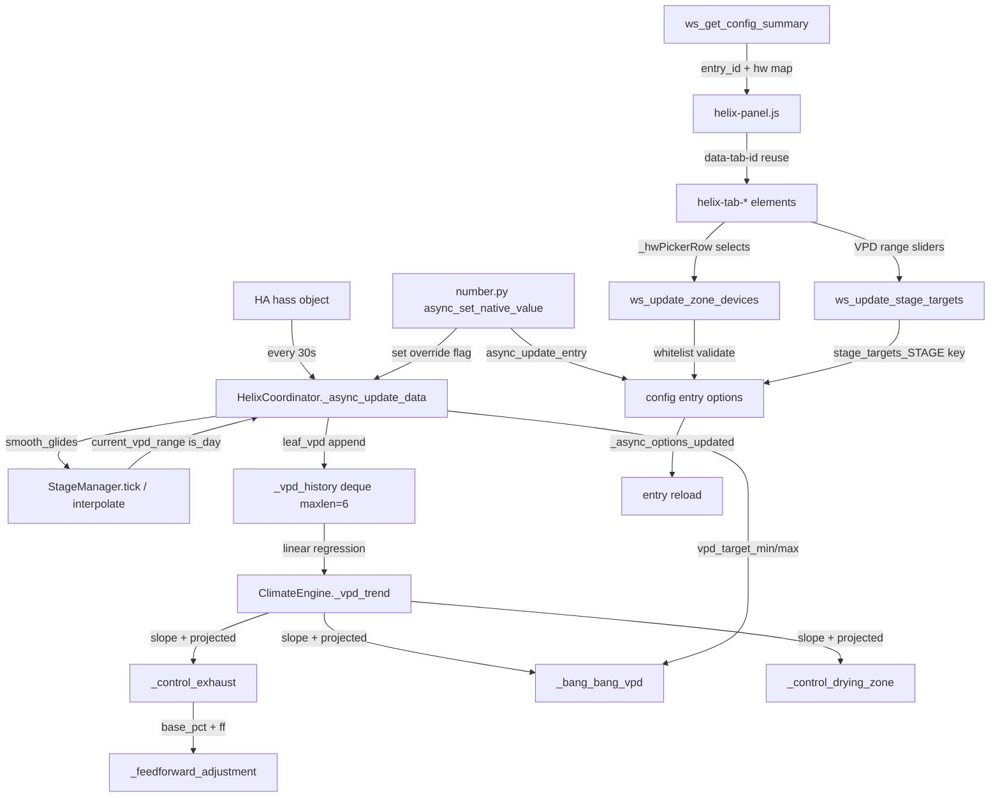
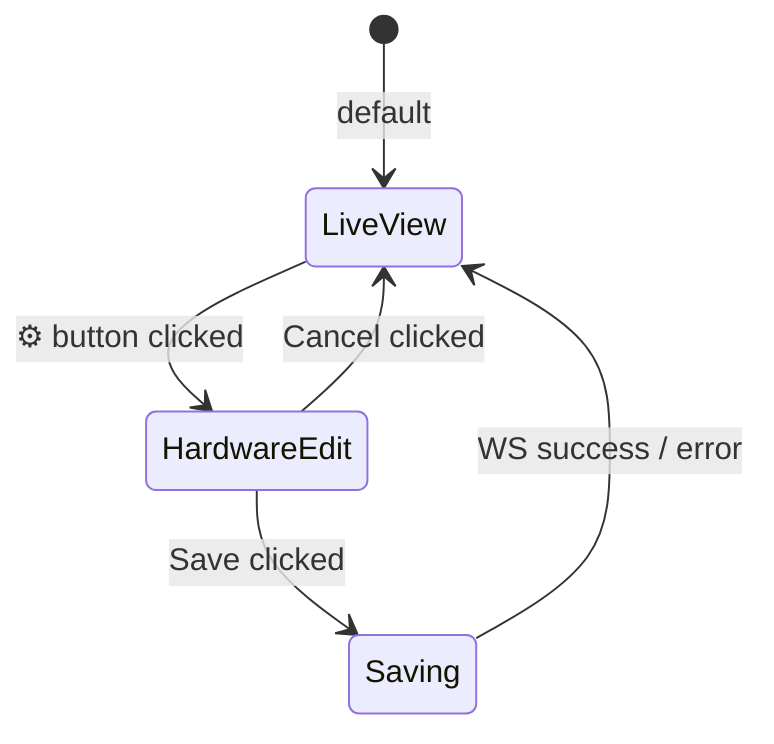
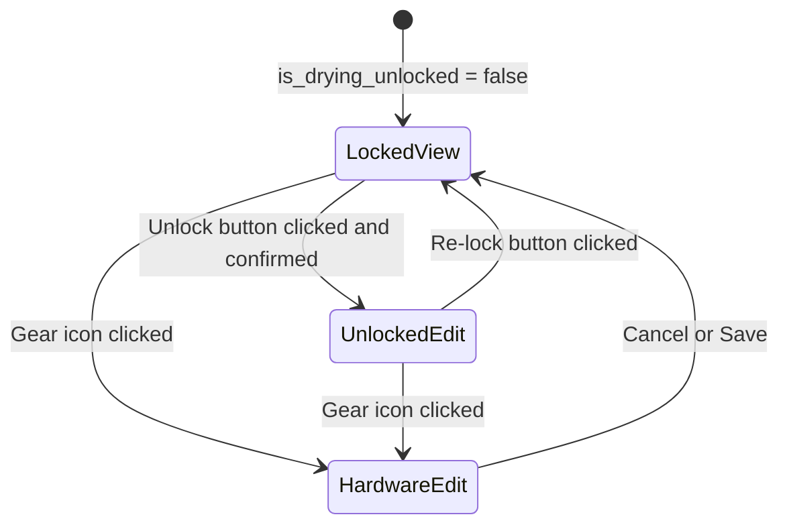
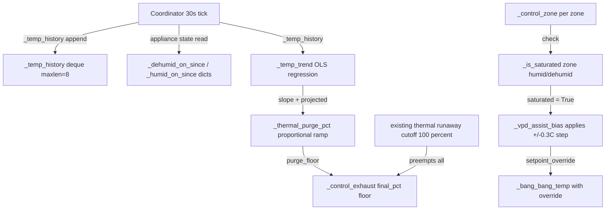
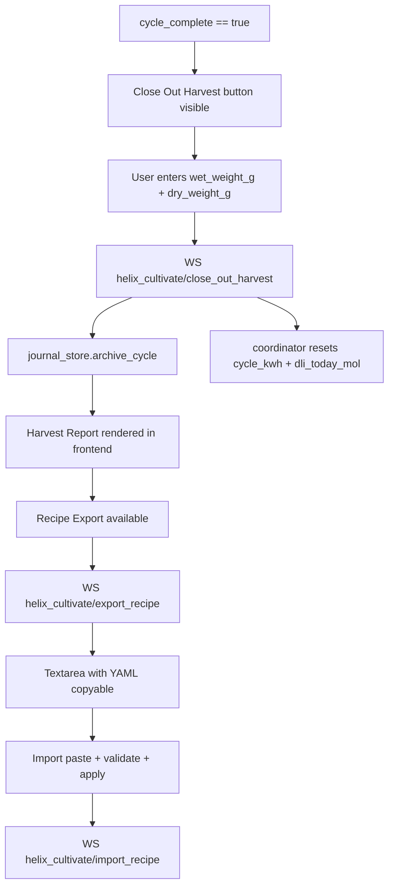

# Helix Cultivate — Refactor Blueprint v3.0

> **Canonical Zone Convention (enforced throughout this plan)**
> `Zone 1` = Conditioning Room / Lung Room | `Zone 2` = Primary Grow Space / Tent / Cultivation
> This matches `climate_engine.py`, `const.py` CONF_ZONE1_*/CONF_ZONE2_* keys, and sensor keys already in production.

---

## Data-Flow Overview



---

## Failure Domain Matrix

| Failure | Scope | Guard |
|---------|-------|-------|
| Sensor dropout > threshold | Exhaust safe floor + VPD suspended | `_check_sensor_dropout` watchdog |
| `async_update_entry` on every slider drag | Full entry reload on each input event | **Debounce**: only call on `change` not `input` — frontend already does this; no backend debounce needed |
| `ws_update_zone_devices` writes arbitrary keys | Config entry corruption | `ALL_VALID_ZONE_DEVICE_KEYS` frozenset whitelist |
| `_vpd_history` < 3 samples | Cannot regress | `_vpd_trend` returns `None, None` — callers guard with `if projected is not None` |
| `vpd_target_min/max` not set on coordinator | Division by zero / wrong deadband | `getattr(coord, "vpd_target_min", coord.vpd_target - VPD_DEADBAND_KPA)` fallback in engine |
| Manual override flag never cleared | User stuck after stage advance | Override flags cleared in `_advance_stage()` and `set_stage()` |
| `ws_update_zone_devices` triggers `_async_options_updated` | Hardware remap needs full reload — **desired, no debounce** | Comment in WS handler |
| `ws_update_stage_targets` triggers `_async_options_updated` | Stage target changes need coordinator to re-read new profile — **desired** | Comment in WS handler |

---

## Phase 1 — Bug Fixes (no new features)

### Phase 1A — `helix-panel.js` `HelixPanel._update()` Tab Element Reuse

**Root cause confirmed** (line 2146): `content.innerHTML = ''` runs unconditionally on every 30s hass-set tick, destroying `<helix-tab-settings>` and resetting `this._section = 'modules'` in its constructor.

**Contract:**
- Remove lines 2141–2146 (the dead `existing` variable and `content.innerHTML = ''`)
- Replace with element-reuse guard keyed on `data-tab-id`
- Apply CSS vars to existing element via `el.style.cssText = ...` on every update (no regression)
- Pass `el.hass` and `el.data` on every update regardless (idempotent property setters)
- Journal-tab extra props (`el.stage`, `el.waterEc`) set on every update regardless of reuse

**Exact replacement block for `_update()` lines 2141–2189:**

```javascript
const tabMap = {
  telemetry:    'helix-tab-telemetry',
  plant_cycle:  'helix-tab-cycle',
  grow_space:   'helix-tab-growspace',
  conditioning: 'helix-tab-conditioning',
  drying:       'helix-tab-drying',
  journal:      'helix-tab-journal',
  settings:     'helix-tab-settings',
};

const tagName = tabMap[this._activeTab];
if (!tagName) return;

let el = content.firstElementChild;
if (!el || el.getAttribute('data-tab-id') !== this._activeTab) {
  content.innerHTML = '';
  el = document.createElement(tagName);
  el.setAttribute('data-tab-id', this._activeTab);
  content.appendChild(el);
}

// Apply theme CSS vars to element on every tick (non-destructive)
el.style.cssText = `
  --hx-bg:${getComputedStyle(this).getPropertyValue('--hx-bg') || '#0f0f17'};
  --hx-surface:${getComputedStyle(this).getPropertyValue('--hx-surface') || '#1a1a2e'};
  ...
`;

el.hass = this._hass;
el.data = data;

if (this._activeTab === 'journal') {
  el.stage   = data.grow_stage_slug;
  el.waterEc = data.water_baseline_ec ?? null;
}
```

**Side-effect:** This same "reuse, don't recreate" pattern already resolves the fan-speed revert symptom for `helix-tab-growspace` — the `_fanCard()` `d[tier_fan_speed] ?? 50` fallback no longer fires because the element is not recreated on every tick.

---

### Phase 1B — `coordinator.py` Manual Override Flags

**File:** [`coordinator.py`](../custom_components/helix_cultivate/coordinator.py)

**New attributes in `__init__`** (after line 148, within the runtime setpoints block):

```python
# ── Manual override flags (set by number entities, cleared on stage advance) ──
self.temp_setpoint_manual_override: bool = False
self.vpd_target_manual_override: bool = False
self.rh_setpoint_manual_override: bool = False
```

**Replace smooth_glides block** (lines 413–422) with guard-aware version:

```python
if self.smooth_glides_enabled:
    sm_vpd  = self.stage_manager.current_vpd_target()
    sm_temp = self.stage_manager.current_temp_setpoint()
    sm_rh   = self.stage_manager.current_rh_setpoint()
    if sm_vpd is not None and not self.vpd_target_manual_override:
        self.vpd_target = sm_vpd
    if sm_temp is not None and not self.temp_setpoint_manual_override:
        self.temp_setpoint = sm_temp
    if sm_rh is not None and not self.rh_setpoint_manual_override:
        self.rh_setpoint = sm_rh
```

**In `set_fan_speed()`** (line 562) — add immediate state propagation:

```python
def set_fan_speed(self, tier: str, speed_pct: float) -> None:
    self._fan_speeds[tier] = max(0.0, min(100.0, speed_pct))
    if not getattr(self, f"breeze_{tier}_enabled", False):
        self.hass.async_create_task(
            self._apply_fan_speed_to_tier(tier, self._fan_speeds[tier])
        )
    # Propagate immediately without waiting for the next 30s poll
    if hasattr(self, "async_update_listeners"):
        self.async_update_listeners()
```

---

### Phase 1C — `stage_manager.py` Override Flag Clearing

**File:** [`stage_manager.py`](../custom_components/helix_cultivate/stage_manager.py)

In `_advance_stage()` (after line 213, after `self._config["current_stage"] = self._current_stage`):

```python
# Clear manual override flags — fresh stage = fresh glide
for flag in ("temp_setpoint_manual_override", "vpd_target_manual_override", "rh_setpoint_manual_override"):
    # Coordinator reference is not directly available; set via config sentinel
    self._config[f"_clear_override_{flag}"] = True
```

**Better pattern:** Pass coordinator reference into StageManager at construction. `StageManager.__init__` receives `hass` already — store `self._coord_ref: Optional[HelixCoordinator] = None`. Coordinator sets `self.stage_manager._coord_ref = self` after construction. Then `_advance_stage` and `set_stage` call:

```python
if self._coord_ref is not None:
    self._coord_ref.temp_setpoint_manual_override = False
    self._coord_ref.vpd_target_manual_override = False
    self._coord_ref.rh_setpoint_manual_override = False
```

---

### Phase 1D — `number.py` Override Flag Setters

**File:** [`number.py`](../custom_components/helix_cultivate/number.py)

Replace `async_set_native_value` (lines 346–352):

```python
async def async_set_native_value(self, value: float) -> None:
    try:
        self.entity_description.set_fn(self.coordinator, value)
        if self.entity_description.key == NUMBER_TEMP_SETPOINT:
            self.coordinator.temp_setpoint_manual_override = True
        elif self.entity_description.key == NUMBER_VPD_TARGET:
            self.coordinator.vpd_target_manual_override = True
        elif self.entity_description.key == NUMBER_RH_SETPOINT:
            self.coordinator.rh_setpoint_manual_override = True
    except Exception as exc:  # noqa: BLE001
        _LOGGER.warning("Helix Cultivate: number set_fn failed: %s", exc)
    self.async_write_ha_state()
    if hasattr(self.coordinator, "async_update_listeners"):
        self.coordinator.async_update_listeners()
```

---

## Phase 2 — Zone Nomenclature Correction

### Canonical Convention

```
# Zone 1 = Conditioning Room (Lung Room). Zone 2 = Primary Grow Space (Tent/Cultivation).
```

This comment goes at the top of the `CONF_ZONE1_*` block in [`const.py`](../custom_components/helix_cultivate/const.py) line ~270.

### Current State vs. Target State

| Location | Current (WRONG) | Target (CORRECT) |
|---|---|---|
| `options_flow.py` `async_step_zone1_devices()` | Maps canopy sensors, exhaust, Zone1 HVAC — **this is Grow Space / Zone 2 content** | Must map **lung sensors + Zone 1 HVAC** |
| `options_flow.py` `async_step_zone2_devices()` | Maps lung sensors, Zone 2 HVAC — **this is Conditioning Room / Zone 1 content** | Must map **canopy sensors + exhaust + Zone 2 HVAC** |
| `_ZONE1_ENTITY_KEYS` | Contains Zone 2 grow space keys | Must contain Zone 1 conditioning keys |
| `_ZONE2_ENTITY_KEYS` | Contains Zone 1 conditioning keys | Must contain Zone 2 grow space keys |
| `en.json` `zone1_devices` | Labels say conditioning room — **but step content maps grow space** | Labels must match corrected step content |
| `en.json` `zone2_devices` | Labels say grow space — **but step content maps conditioning** | Labels must match corrected step content |

### Phase 2A — `options_flow.py` Step Content Swap

**Step routing chain** (corrected):

```
async_step_primary_sensors
  → async_step_zone2_devices  (Primary Grow Space: canopy sensors, exhaust, Zone 2 HVAC)
      → [if conditioning enabled] async_step_zone1_devices  (Conditioning Room: lung sensors, Zone 1 HVAC)
          → _next_after_zone1  (renamed from _next_after_zone2)
      → [else] _next_after_zone1
          → [if drying] async_step_drying_zone
          → async_step_fan_matrix
```

**Swap function bodies:**
- `async_step_zone1_devices` ← receives lung/Zone1 conditioning content (what is currently in `zone2_devices`)
- `async_step_zone2_devices` ← receives canopy/exhaust/Zone2 grow space content (what is currently in `zone1_devices`)
- Rename `_next_after_zone2` → `_next_after_zone1`
- The `conditioning_on` gate moves from `async_step_zone2_devices` to `async_step_zone1_devices`
- `async_step_primary_sensors` routes to `async_step_zone2_devices` (was `zone1_devices`)

**`step_id` strings** in `async_show_form` calls:
- `async_step_zone1_devices` → `step_id="zone1_devices"` (now correctly shows lung/conditioning content)
- `async_step_zone2_devices` → `step_id="zone2_devices"` (now correctly shows canopy/grow space content)

### Phase 2B — `_ZONE1_ENTITY_KEYS` / `_ZONE2_ENTITY_KEYS` Swap

```python
# After swap — Zone 1 = Conditioning Room keys:
_ZONE1_ENTITY_KEYS: tuple[str, ...] = (
    CONF_LUNG_TEMP_SENSOR,
    CONF_LUNG_HUMIDITY_SENSOR,
    CONF_ZONE1_AC,
    CONF_ZONE1_HEATER,
    CONF_ZONE1_BACKUP_HEATER,
    CONF_ZONE1_REVERSE_CYCLE,
    CONF_ZONE1_HUMIDIFIER,
    CONF_ZONE1_DEHUMIDIFIER,
)

# After swap — Zone 2 = Primary Grow Space keys:
_ZONE2_ENTITY_KEYS: tuple[str, ...] = (
    CONF_ZONE2_AC,
    CONF_ZONE2_HEATER,
    CONF_ZONE2_REVERSE_CYCLE,
    CONF_ZONE2_HUMIDIFIER,
    CONF_ZONE2_DEHUMIDIFIER,
    CONF_OUTDOOR_WEATHER_ENTITY,
    CONF_UPPER_CANOPY_TEMP_SENSOR,
    CONF_UPPER_CANOPY_HUMIDITY_SENSOR,
    CONF_MID_CANOPY_TEMP_SENSOR,
    CONF_MID_CANOPY_HUMIDITY_SENSOR,
    CONF_LOWER_CANOPY_TEMP_SENSOR,
    CONF_LOWER_CANOPY_HUMIDITY_SENSOR,
    CONF_EXHAUST_FAN,
)
```

### Phase 2C — `en.json` Swap + `const.py` Comment

**`en.json` target state (both `config.step` and `options.step`):**

```json
"zone1_devices": {
  "title": "Helix Cultivate — Conditioning Room Appliances",
  "data": {
    "lung_temp_sensor": "Conditioning Room Temperature Sensor",
    "lung_humidity_sensor": "Conditioning Room Humidity Sensor",
    "zone1_ac": "Zone 1 Air Conditioner / Cooler",
    "zone1_is_reverse_cycle": "This unit is a Reverse-Cycle Heat Pump",
    "zone1_heater": "Zone 1 Heater (or Backup Heater if Reverse-Cycle)",
    "zone1_backup_heater_threshold_c": "Backup Heater Stage-On Threshold (°C outdoor)",
    "zone1_humidifier": "Zone 1 Humidifier",
    "zone1_dehumidifier": "Zone 1 Dehumidifier"
  }
},
"zone2_devices": {
  "title": "Helix Cultivate — Grow Space Appliances and Extra Sensors",
  "data": {
    "upper_canopy_temp_sensor": "Upper Canopy Temperature Sensor",
    "upper_canopy_humidity_sensor": "Upper Canopy Humidity Sensor",
    "mid_canopy_temp_sensor": "Mid Canopy Temperature Sensor",
    "mid_canopy_humidity_sensor": "Mid Canopy Humidity Sensor",
    "lower_canopy_temp_sensor": "Lower Canopy Temperature Sensor",
    "lower_canopy_humidity_sensor": "Lower Canopy Humidity Sensor",
    "exhaust_fan": "Exhaust Fan",
    "zone2_ac": "Zone 2 Air Conditioner / Cooler",
    "zone2_is_reverse_cycle": "This unit is a Reverse-Cycle Heat Pump",
    "zone2_heater": "Zone 2 Heater",
    "zone2_humidifier": "Zone 2 Humidifier",
    "zone2_dehumidifier": "Zone 2 Dehumidifier",
    "outdoor_weather_entity": "Outdoor Weather Entity (Feedforward MPC)"
  }
}
```

**Note:** The `config.step` section in `en.json` currently has the correct labels for `zone1_devices` (conditioning) and `zone2_devices` (grow space), but `options.step` also needs the same correction applied. The `options.step.zone1_devices` currently also correctly labels conditioning hardware, and `options.step.zone2_devices` labels grow space hardware — **the en.json labels are already correct** for the *target* convention. Only the Python step function *bodies* are inverted. No `en.json` swap needed; the file is already aligned with the target convention. The `is_reverse_cycle` and `backup_heater_threshold_c` fields need to be added to translations since they exist in the schema but lack translation entries.

---

## Phase 3 — Config Entry Persistence

### Phase 3A — `number.py` Setters → `async_update_entry`

**Debounce analysis:** `async_update_entry` triggers `_async_options_updated` → full entry reload. The frontend sends one WS call per `change` event (on slider release), not per `input` event (on drag). This is already correct behaviour — no additional debounce needed in the backend.

**Affected setters** (currently only mutate `c._config` in memory):

| Number Key | Config Key | Current setter |
|---|---|---|
| `NUMBER_HEATER_CUTOFF` | `heater_cutoff_c` | `c._config.update({"heater_cutoff_c": v})` |
| `NUMBER_THERMAL_RUNAWAY` | `thermal_runaway_c` | `c._config.update({"thermal_runaway_c": v})` |
| `NUMBER_ANTI_SHORT_CYCLE` | `anti_short_cycle_min` | `c._config.update({"anti_short_cycle_min": int(v)})` |
| `NUMBER_EXHAUST_MIN_PCT` | `exhaust_min_pct` | `c._config.update({"exhaust_min_pct": int(v)})` |
| `NUMBER_LEAF_TEMP_OFFSET` | `leaf_temp_offset_c` | `c._config.update({"leaf_temp_offset_c": v})` |
| `NUMBER_SUNRISE_RAMP_MIN` | `sunrise_ramp_min` | `c._config.update({"sunrise_ramp_min": int(v)})` |
| `NUMBER_ELECTRICITY_RATE` | `electricity_rate` | `c._config.update({"electricity_rate": round(v, 4)})` |
| `NUMBER_UPPER_FAN_VARIANCE` | `breeze_variance_upper` | `c._config[key] = v` |
| `NUMBER_MID_FAN_VARIANCE` | `breeze_variance_mid` | `c._config[key] = v` |
| `NUMBER_LOWER_FAN_VARIANCE` | `breeze_variance_lower` | `c._config[key] = v` |

**Pattern for all persistent setters:**

```python
def _persistent_setter(config_key: str, coerce=float) -> Callable[[HelixCoordinator, float], None]:
    def _set(c: HelixCoordinator, v: float) -> None:
        coerced = coerce(v)
        c._config[config_key] = coerced
        new_options = {**c._entry.options, config_key: coerced}
        c.hass.config_entries.async_update_entry(c._entry, options=new_options)
    return _set
```

**`vpd_target`, `temp_setpoint`, `rh_setpoint`, `light_intensity_pct`** are runtime-only coordinator attributes — they deliberately do NOT persist via `async_update_entry` (smooth glides recalculates them on every tick; manual override flags protect them). No change needed for these three.

### Phase 3B — `select.py` Setters → `async_update_entry`

Audit all `set_fn` lambdas in `select.py` that mutate `c._config` in memory — apply the same `_persistent_setter`-equivalent pattern. Expected affected keys: `control_algorithm`, `fan_control_mode`, `light_type`, `progression_mode`, `current_stage` (stage select).

**Exception:** `current_stage` setter also calls `stage_manager.set_stage()` — preserve that side-effect.

### Phase 3C — Reload Safety Note

`async_update_entry` on a number setter triggers `_async_options_updated` → `async_reload` → full teardown + re-setup. This means:

- **On slider drag** (multiple `input` events per second): No issue — the frontend sends only `change` events to HA number entities. HA's own debouncing applies.
- **On options flow submit**: Full reload is expected and desired.
- **On hardware gear-icon save** (§5): Full reload is expected and desired (hardware remap requires coordinator to re-read entity IDs).
- **On stage target WS save** (§6): Full reload is expected and desired (coordinator needs updated profiles).

---

## Phase 4 — Per-Zone Hardware Mapping (Gear Icon)

### Phase 4A — `const.py` `ALL_VALID_ZONE_DEVICE_KEYS`

Add near the bottom of [`const.py`](../custom_components/helix_cultivate/const.py):

```python
# ── Whitelist for ws_update_zone_devices WebSocket command ───────────────────
# Prevents arbitrary key injection into config entry options.
ALL_VALID_ZONE_DEVICE_KEYS: frozenset[str] = frozenset({
    # Zone 2 — Primary Grow Space
    CONF_PRIMARY_TEMP_SENSOR,
    CONF_PRIMARY_HUMIDITY_SENSOR,
    CONF_UPPER_CANOPY_TEMP_SENSOR,
    CONF_UPPER_CANOPY_HUMIDITY_SENSOR,
    CONF_MID_CANOPY_TEMP_SENSOR,
    CONF_MID_CANOPY_HUMIDITY_SENSOR,
    CONF_LOWER_CANOPY_TEMP_SENSOR,
    CONF_LOWER_CANOPY_HUMIDITY_SENSOR,
    CONF_EXHAUST_FAN,
    CONF_ZONE2_HEATER,
    CONF_ZONE2_AC,
    CONF_ZONE2_IS_REVERSE_CYCLE,
    CONF_ZONE2_HUMIDIFIER,
    CONF_ZONE2_DEHUMIDIFIER,
    CONF_GROW_LIGHT,
    CONF_DLI_SENSOR,
    CONF_GROW_CAMERA,
    CONF_OUTDOOR_WEATHER_ENTITY,
    # Zone 1 — Conditioning Room
    CONF_LUNG_TEMP_SENSOR,
    CONF_LUNG_HUMIDITY_SENSOR,
    CONF_ZONE1_HEATER,
    CONF_ZONE1_AC,
    CONF_ZONE1_IS_REVERSE_CYCLE,
    CONF_ZONE1_HUMIDIFIER,
    CONF_ZONE1_DEHUMIDIFIER,
    CONF_ZONE1_BACKUP_HEATER,
    # Drying Zone
    CONF_DRYING_TEMP_SENSOR,
    CONF_DRYING_HUMIDITY_SENSOR,
    CONF_DRYING_EXHAUST_FAN,
    CONF_DRYING_CIRCULATION_FAN,
    CONF_DRYING_DEHUMIDIFIER,
    CONF_DRYING_AC,
    CONF_DRYING_IS_REVERSE_CYCLE,
    CONF_DRYING_HEATER,
    CONF_DRYING_LIGHT,
})
```

### Phase 4B — `__init__.py` WebSocket Commands

**Two new WS commands** registered in `async_setup_entry` after `async_setup_journal`:

#### `helix_cultivate/update_zone_devices`

```python
WS_CMD_UPDATE_ZONE_DEVICES = "helix_cultivate/update_zone_devices"

@websocket_api.websocket_command({
    vol.Required("type"): WS_CMD_UPDATE_ZONE_DEVICES,
    vol.Required("entry_id"): str,
    vol.Required("devices"): dict,
})
@websocket_api.async_response
async def ws_update_zone_devices(hass, connection, msg):
    entry = hass.config_entries.async_get_entry(msg["entry_id"])
    if not entry:
        connection.send_error(msg["id"], "entry_not_found", "Config entry not found")
        return
    from .const import ALL_VALID_ZONE_DEVICE_KEYS
    devices = {k: (v or None) for k, v in msg["devices"].items()
               if k in ALL_VALID_ZONE_DEVICE_KEYS}
    new_options = {**entry.options, **devices}
    hass.config_entries.async_update_entry(entry, options=new_options)
    # Note: triggers _async_options_updated → full reload. Desired: hardware remap needs coordinator restart.
    connection.send_result(msg["id"], {"success": True})
```

#### `helix_cultivate/get_config_summary`

```python
WS_CMD_GET_CONFIG_SUMMARY = "helix_cultivate/get_config_summary"

@websocket_api.websocket_command({
    vol.Required("type"): WS_CMD_GET_CONFIG_SUMMARY,
})
@websocket_api.async_response
async def ws_get_config_summary(hass, connection, msg):
    from .const import DOMAIN, ALL_VALID_ZONE_DEVICE_KEYS
    # Find the first active Helix Cultivate config entry
    entries = hass.config_entries.async_entries(DOMAIN)
    if not entries:
        connection.send_error(msg["id"], "no_entry", "No Helix Cultivate config entry found")
        return
    entry = entries[0]
    merged = {**entry.data, **entry.options}
    hw_map = {k: merged.get(k) for k in ALL_VALID_ZONE_DEVICE_KEYS if merged.get(k)}
    connection.send_result(msg["id"], {
        "entry_id": entry.entry_id,
        "hardware": hw_map,
    })
```

**Registration in `async_setup_entry`:**

```python
websocket_api.async_register_command(hass, ws_update_zone_devices)
websocket_api.async_register_command(hass, ws_get_config_summary)
```

**Registration is idempotent** — wrap in `try/except` same as journal WS commands.

### Phase 4C — `helix-panel.js` Entry ID Caching

In `HelixPanel` constructor, add:

```javascript
this._entryId = null;
this._hwMap = {};
```

In `connectedCallback()`, after `_ensureScaffold()`:

```javascript
this._fetchConfigSummary();
```

New method:

```javascript
async _fetchConfigSummary() {
  try {
    const result = await this._hass.callWS({ type: 'helix_cultivate/get_config_summary' });
    this._entryId = result.entry_id;
    this._hwMap   = result.hardware || {};
    this._update();
  } catch (e) {
    console.warn('Helix Cultivate: could not fetch config summary', e);
  }
}
```

In `_buildData()`, add `entry_id: this._entryId` and `hw_map: this._hwMap` to the returned object.

### Phase 4D — Zone Tab Hardware Picker UI

**Per-tab hardware key maps** (aligned with corrected Zone 1/Zone 2 convention):

```javascript
const ZONE2_HW_KEYS = [
  { key: 'upper_canopy_temp_sensor',     label: 'Upper Canopy Temp',     domains: ['sensor'] },
  { key: 'upper_canopy_humidity_sensor', label: 'Upper Canopy Humidity',  domains: ['sensor'] },
  { key: 'mid_canopy_temp_sensor',       label: 'Mid Canopy Temp',        domains: ['sensor'] },
  { key: 'mid_canopy_humidity_sensor',   label: 'Mid Canopy Humidity',    domains: ['sensor'] },
  { key: 'lower_canopy_temp_sensor',     label: 'Lower Canopy Temp',      domains: ['sensor'] },
  { key: 'lower_canopy_humidity_sensor', label: 'Lower Canopy Humidity',  domains: ['sensor'] },
  { key: 'exhaust_fan',                  label: 'Exhaust Fan',            domains: ['fan','switch'] },
  { key: 'zone2_ac',                     label: 'Zone 2 AC / Cooler',     domains: ['climate','switch'] },
  { key: 'zone2_heater',                 label: 'Zone 2 Heater',          domains: ['switch','climate'] },
  { key: 'zone2_humidifier',             label: 'Zone 2 Humidifier',      domains: ['switch','climate'] },
  { key: 'zone2_dehumidifier',           label: 'Zone 2 Dehumidifier',    domains: ['switch','climate'] },
];

const ZONE1_HW_KEYS = [
  { key: 'lung_temp_sensor',     label: 'Conditioning Room Temp',     domains: ['sensor'] },
  { key: 'lung_humidity_sensor', label: 'Conditioning Room Humidity', domains: ['sensor'] },
  { key: 'zone1_ac',             label: 'Zone 1 AC / Cooler',         domains: ['climate','switch'] },
  { key: 'zone1_heater',         label: 'Zone 1 Heater',              domains: ['switch','climate'] },
  { key: 'zone1_humidifier',     label: 'Zone 1 Humidifier',          domains: ['switch','climate'] },
  { key: 'zone1_dehumidifier',   label: 'Zone 1 Dehumidifier',        domains: ['switch','climate'] },
  { key: 'zone1_backup_heater',  label: 'Zone 1 Backup Heater',       domains: ['switch'] },
];

const DRYING_HW_KEYS = [
  { key: 'drying_temp_sensor',        label: 'Drying Room Temp',        domains: ['sensor'] },
  { key: 'drying_humidity_sensor',    label: 'Drying Room Humidity',    domains: ['sensor'] },
  { key: 'drying_exhaust_fan',        label: 'Drying Exhaust Fan',      domains: ['fan','switch'] },
  { key: 'drying_circulation_fan',    label: 'Drying Circulation Fan',  domains: ['fan','switch'] },
  { key: 'drying_dehumidifier',       label: 'Drying Dehumidifier',     domains: ['switch','climate'] },
  { key: 'drying_ac',                 label: 'Drying AC',               domains: ['climate','switch'] },
  { key: 'drying_heater',             label: 'Drying Heater',           domains: ['switch','climate'] },
  { key: 'drying_light',              label: 'Inspection Light',        domains: ['light','switch'] },
];
```

**State machine per tab class:**



**`_render()` branch logic** (added to `helix-tab-growspace`, `helix-tab-conditioning`, `helix-tab-drying`):

```javascript
_render() {
  if (this._isEditingHardware) {
    this.shadowRoot.innerHTML = this._renderHardwarePicker(HW_KEYS_FOR_THIS_TAB);
    this._bindHwPickerListeners();
  } else {
    this.shadowRoot.innerHTML = this._renderLiveView();
  }
}
```

**Gear button** injected into each `.card-title` row:

```html
<button class="hx-gear-btn" title="Configure Hardware" 
  style="margin-left:auto;background:none;border:none;cursor:pointer;color:var(--hx-text2)">⚙</button>
```

**Save flow:**
1. Collect `this._pendingDevices` from `change` events on `<select>` elements
2. Call `this._hass.callWS({ type: 'helix_cultivate/update_zone_devices', entry_id: this.data.entry_id, devices: this._pendingDevices })`
3. Show inline "Saving… integration will briefly reload" message
4. On success: `this._isEditingHardware = false; this._render()`
5. On error: show inline error, remain in edit mode

---

## Phase 5 — Day/Night Stage Profiles + VPD Range

### Phase 5A — `const.py` `STAGE_DAYNIGHT_DEFAULTS`

Add below the existing `_STAGE_DEFAULTS` equivalent (or move to `stage_manager.py` — recommend keeping in `const.py` for importability):

```python
STAGE_DAYNIGHT_DEFAULTS: dict[str, dict[str, Any]] = {
    "germination": {
        "day_temp_c": 24.0, "night_temp_c": 22.0,
        "day_vpd_min": 0.35, "day_vpd_max": 0.50,
        "night_vpd_min": 0.30, "night_vpd_max": 0.45,
        "light_intensity_pct": 50, "photoperiod_h": 20.0,
        "fan_speed_pct": 25,
    },
    "seedling": {
        "day_temp_c": 23.5, "night_temp_c": 21.0,
        "day_vpd_min": 0.50, "day_vpd_max": 0.70,
        "night_vpd_min": 0.40, "night_vpd_max": 0.60,
        "light_intensity_pct": 60, "photoperiod_h": 20.0,
        "fan_speed_pct": 30,
    },
    "early_veg": {
        "day_temp_c": 24.0, "night_temp_c": 20.0,
        "day_vpd_min": 0.60, "day_vpd_max": 0.90,
        "night_vpd_min": 0.45, "night_vpd_max": 0.65,
        "light_intensity_pct": 70, "photoperiod_h": 18.0,
        "fan_speed_pct": 35,
    },
    "late_veg": {
        "day_temp_c": 24.0, "night_temp_c": 20.0,
        "day_vpd_min": 0.80, "day_vpd_max": 1.05,
        "night_vpd_min": 0.60, "night_vpd_max": 0.80,
        "light_intensity_pct": 80, "photoperiod_h": 18.0,
        "fan_speed_pct": 40,
    },
    "stretch": {
        "day_temp_c": 25.0, "night_temp_c": 21.0,
        "day_vpd_min": 0.90, "day_vpd_max": 1.15,
        "night_vpd_min": 0.70, "night_vpd_max": 0.90,
        "light_intensity_pct": 90, "photoperiod_h": 12.0,
        "fan_speed_pct": 45,
    },
    "peak_flower": {
        "day_temp_c": 26.0, "night_temp_c": 22.0,
        "day_vpd_min": 1.10, "day_vpd_max": 1.40,
        "night_vpd_min": 0.85, "night_vpd_max": 1.10,
        "light_intensity_pct": 100, "photoperiod_h": 12.0,
        "fan_speed_pct": 50,
    },
    "ripening": {
        "day_temp_c": 24.0, "night_temp_c": 18.0,
        "day_vpd_min": 1.30, "day_vpd_max": 1.55,
        "night_vpd_min": 1.00, "night_vpd_max": 1.25,
        "light_intensity_pct": 85, "photoperiod_h": 12.0,
        "fan_speed_pct": 45,
    },
    "drying": {
        "day_temp_c": 15.5, "night_temp_c": 15.5,
        "day_vpd_min": 1.05, "day_vpd_max": 1.15,
        "night_vpd_min": 1.05, "night_vpd_max": 1.15,
        "light_intensity_pct": 0, "photoperiod_h": 0.0,
        "fan_speed_pct": 40,
    },
}
```

### Phase 5B — `stage_manager.py` Extended Profile API

**Import `STAGE_DAYNIGHT_DEFAULTS` from const.**

**Extended `_profile(stage)` return dict** — merge daynight keys on top of existing profile:

```python
def _profile(self, stage: str) -> dict[str, Any]:
    # 1. Start from STAGE_DAYNIGHT_DEFAULTS
    base = dict(STAGE_DAYNIGHT_DEFAULTS.get(stage, STAGE_DAYNIGHT_DEFAULTS["germination"]))
    # 2. Overlay recipe values
    if self._recipe:
        stage_data = self._recipe.get("stages", {}).get(stage, {})
        for k, v in stage_data.items():
            base[k] = v
    # 3. Overlay user-persisted stage_targets_{stage} from config entry options
    user_targets = self._config.get(f"stage_targets_{stage}", {})
    if isinstance(user_targets, dict):
        base.update(user_targets)
    return base
```

**New public accessors:**

```python
def current_vpd_range(self, is_day: bool) -> tuple[float, float]:
    """Return (vpd_min, vpd_max) interpolated between current and next stage."""
    min_key = "day_vpd_min" if is_day else "night_vpd_min"
    max_key = "day_vpd_max" if is_day else "night_vpd_max"
    vpd_min = self._interpolate_key(min_key)
    vpd_max = self._interpolate_key(max_key)
    return (vpd_min or 0.8, vpd_max or 1.2)

def current_temp_anchor(self, is_day: bool) -> float:
    key = "day_temp_c" if is_day else "night_temp_c"
    return self._interpolate_key(key) or self._profile(self._current_stage).get(key, 24.0)

def current_fan_speed_pct(self) -> float:
    return self._interpolate_key("fan_speed_pct") or self._profile(self._current_stage).get("fan_speed_pct", 50.0)
```

**New `_interpolate_key(key)` helper** — generalises `_interpolate()` to work on any profile key (same algorithm, accepts arbitrary key string).

**Override flag clearing** (via `_coord_ref` pattern from Phase 1C):

```python
def _advance_stage(self) -> None:
    ...existing logic...
    if self._coord_ref is not None:
        self._coord_ref.temp_setpoint_manual_override = False
        self._coord_ref.vpd_target_manual_override = False
        self._coord_ref.rh_setpoint_manual_override = False

def set_stage(self, stage: str) -> None:
    ...existing logic...
    if self._coord_ref is not None:
        self._coord_ref.temp_setpoint_manual_override = False
        self._coord_ref.vpd_target_manual_override = False
        self._coord_ref.rh_setpoint_manual_override = False
```

### Phase 5C — `coordinator.py` Day/Night Smooth Glides Block

**New coordinator attributes** (in `__init__` after `self.vpd_target`):

```python
self.vpd_target_min: float = 0.8
self.vpd_target_max: float = 1.2
```

**Replace smooth_glides block** (Phase 1B already guards with override flags; extend it):

```python
is_day = self._lights_on()   # evaluated before stage_manager.tick()
if self.smooth_glides_enabled:
    vpd_min, vpd_max = self.stage_manager.current_vpd_range(is_day)
    sm_temp = self.stage_manager.current_temp_anchor(is_day)
    if not self.vpd_target_manual_override:
        self.vpd_target = (vpd_min + vpd_max) / 2.0
        self.vpd_target_min = vpd_min
        self.vpd_target_max = vpd_max
    if sm_temp is not None and not self.temp_setpoint_manual_override:
        self.temp_setpoint = sm_temp
    # RH setpoint: derive from midpoint VPD at anchor temp (Tetens formula)
    if not self.rh_setpoint_manual_override:
        import math
        t = sm_temp or self.temp_setpoint
        offset = float(self._get(CONF_LEAF_TEMP_OFFSET_C, DEFAULT_LEAF_TEMP_OFFSET_C))
        svp_leaf = 0.6108 * math.exp(17.27 * (t + offset) / (t + offset + 237.3))
        svp_air  = 0.6108 * math.exp(17.27 * t / (t + 237.3))
        mid_vpd  = (vpd_min + vpd_max) / 2.0
        rh_frac  = max(0.0, min(1.0, (svp_leaf - mid_vpd) / svp_air))
        self.rh_setpoint = round(rh_frac * 100.0, 1)
```

**Expose `vpd_target_min`/`vpd_target_max` in NS_CLIMATE dict** for frontend consumption:

```python
NS_CLIMATE: {
    ...existing keys...,
    "vpd_target_min": self.vpd_target_min,
    "vpd_target_max": self.vpd_target_max,
}
```

### Phase 5D — `climate_engine.py` Range-Aware VPD Control

**Replace `_bang_bang_vpd()`:**

```python
def _bang_bang_vpd(self, leaf_vpd: Optional[float]) -> tuple[bool, bool]:
    if leaf_vpd is None:
        return False, False
    vpd_min = getattr(self._coord, "vpd_target_min",
                      self._coord.vpd_target - VPD_DEADBAND_KPA)
    vpd_max = getattr(self._coord, "vpd_target_max",
                      self._coord.vpd_target + VPD_DEADBAND_KPA)
    if leaf_vpd > vpd_max:
        return True, False   # too dry → humidify
    if leaf_vpd < vpd_min:
        return False, True   # too wet → dehumidify
    return False, False
```

**Replace VPD branch in `_control_exhaust()`** (lines 802–820):

```python
elif leaf_vpd is not None:
    vpd_min = getattr(self._coord, "vpd_target_min",
                      self._coord.vpd_target - VPD_DEADBAND_KPA)
    vpd_max = getattr(self._coord, "vpd_target_max",
                      self._coord.vpd_target + VPD_DEADBAND_KPA)
    vpd_error = leaf_vpd - ((vpd_min + vpd_max) / 2.0)
    if self._use_pid():
        base_pct = _pid_step("exhaust_vpd", error=vpd_error, ...)
    else:
        if leaf_vpd > vpd_max + 0.10:
            base_pct = 65.0
        elif leaf_vpd > vpd_max:
            base_pct = 40.0
        else:
            base_pct = min_pct
```

### Phase 5E — `climate_engine.py` `_control_drying_zone()` Stage-Target Integration

In `_control_drying_zone()` (line ~1121), replace hardcoded `DRYING_TARGET_TEMP_C` / `DRYING_TARGET_RH_PCT`:

```python
is_day = self._coord._lights_on()
active_stage = self._coord.stage_manager.current_stage

if active_stage == "drying":
    vpd_min, vpd_max = self._coord.stage_manager.current_vpd_range(is_day)
    target_temp = self._coord.stage_manager.current_temp_anchor(is_day)
    # Convert VPD midpoint to target RH at anchor temp
    import math
    offset = float(self._get(CONF_LEAF_TEMP_OFFSET_C, DEFAULT_LEAF_TEMP_OFFSET_C))
    svp_leaf = 0.6108 * math.exp(17.27 * (target_temp + offset) / (target_temp + offset + 237.3))
    svp_air  = 0.6108 * math.exp(17.27 * target_temp / (target_temp + 237.3))
    mid_vpd  = (vpd_min + vpd_max) / 2.0
    rh_frac  = max(0.0, min(1.0, (svp_leaf - mid_vpd) / svp_air))
    target_rh = rh_frac * 100.0
else:
    # Fallback to fixed constants when not in drying stage
    target_temp = DRYING_TARGET_TEMP_C
    target_rh   = DRYING_TARGET_RH_PCT
```

### Phase 5F — `__init__.py` `ws_update_stage_targets`

```python
WS_CMD_UPDATE_STAGE_TARGETS = "helix_cultivate/update_stage_targets"

VALID_STAGE_TARGET_KEYS: frozenset[str] = frozenset({
    "day_temp_c", "night_temp_c",
    "day_vpd_min", "day_vpd_max",
    "night_vpd_min", "night_vpd_max",
    "light_intensity_pct", "photoperiod_h", "fan_speed_pct",
})

@websocket_api.websocket_command({
    vol.Required("type"): WS_CMD_UPDATE_STAGE_TARGETS,
    vol.Required("entry_id"): str,
    vol.Required("stage"): vol.In(STAGE_SEQUENCE),
    vol.Required("targets"): dict,
})
@websocket_api.async_response
async def ws_update_stage_targets(hass, connection, msg):
    entry = hass.config_entries.async_get_entry(msg["entry_id"])
    if not entry:
        connection.send_error(msg["id"], "entry_not_found", "Config entry not found")
        return
    validated = {k: v for k, v in msg["targets"].items() if k in VALID_STAGE_TARGET_KEYS}
    key = f"stage_targets_{msg['stage']}"
    existing = entry.options.get(key, {})
    merged = {**existing, **validated}
    new_options = {**entry.options, key: merged}
    hass.config_entries.async_update_entry(entry, options=new_options)
    connection.send_result(msg["id"], {"success": True})
```

---

## Phase 6 — Predictive dVPD/dt Trend + MPC Pre-Engagement

### Phase 6A — `coordinator.py` VPD History Buffer

Already has `from collections import deque` (line 7). The `_vpd_history` deque was already in the coordinator's imports — **but not instantiated**. Add to `__init__`:

```python
self._vpd_history: deque = deque(maxlen=6)  # (timestamp, vpd) tuples — 6 × 30s = 3min window
```

In `_async_update_data()`, after `leaf_vpd` is calculated (line ~399):

```python
if leaf_vpd is not None:
    self._vpd_history.append((dt_util.utcnow(), leaf_vpd))
```

### Phase 6B — `climate_engine.py` `_vpd_trend()`

New private method on `ClimateEngine`:

```python
def _vpd_trend(self) -> tuple[Optional[float], Optional[float]]:
    """Simple OLS linear regression over VPD history → (slope kPa/min, projected 3min out)."""
    hist = list(self._coord._vpd_history)
    if len(hist) < 3:
        return None, None
    t0 = hist[0][0]
    xs = [(t - t0).total_seconds() / 60.0 for t, _ in hist]
    ys = [v for _, v in hist]
    n = len(xs)
    mean_x = sum(xs) / n
    mean_y = sum(ys) / n
    num = sum((x - mean_x) * (y - mean_y) for x, y in zip(xs, ys))
    den = sum((x - mean_x) ** 2 for x in xs)
    if den == 0:
        return None, None
    slope = num / den  # kPa per minute
    projected = ys[-1] + slope * 3.0
    return slope, projected
```

### Phase 6C — Predictive Logic in `_control_exhaust()` and `_bang_bang_vpd()`

**Shared pre-computation** (extracted to a helper or inlined both places):

```python
slope, projected = self._vpd_trend()
vpd_min = getattr(self._coord, "vpd_target_min", self._coord.vpd_target - VPD_DEADBAND_KPA)
vpd_max = getattr(self._coord, "vpd_target_max", self._coord.vpd_target + VPD_DEADBAND_KPA)

pre_dehumidify = leaf_vpd is not None and (
    leaf_vpd >= vpd_max or
    (projected is not None and projected >= vpd_max and slope is not None and slope > 0.015)
)
pre_humidify = leaf_vpd is not None and (
    leaf_vpd <= vpd_min or
    (projected is not None and projected <= vpd_min and slope is not None and slope < -0.015)
)
```

**`_bang_bang_vpd()`** uses `pre_humidify` / `pre_dehumidify` replacing raw threshold checks.

**`_control_exhaust()` VPD branch** uses `pre_dehumidify` to determine `base_pct` escalation tier. Feedforward `_feedforward_adjustment()` remains as an additive bias on top (unchanged layering).

### Phase 6D — Predictive Logic in `_control_drying_zone()`

Apply same `slope / projected` pre-engagement pattern to the drying RH check:

```python
slope, projected = self._vpd_trend()
# Trend-aware drying RH control (replaces flat drying_rh > DRYING_TARGET_RH_PCT + 3.0)
pre_dehumid_dry = drying_rh is not None and (
    drying_rh > target_rh + 2.0 or
    (projected is not None and projected < vpd_min and slope is not None and slope < -0.015)
)
```

---

## Phase 7 — Frontend: Plant Cycle Tab Day/Night + VPD Range UI

### Phase 7A — `helix-panel.js` `HelixTabCycle` Redesign

**State added to constructor:**

```javascript
this._editingStage = null;    // null = show active stage; slug = edit that stage
this._editingPeriod = 'day';  // 'day' | 'night'
this._stageDrafts = {};       // { [stage_slug]: { day_vpd_min, day_vpd_max, ... } }
```

**Stage timeline selector** (horizontal pill row showing all 8 stages; active stage highlighted):

```
[Germ] [Seedling] [Early Veg] [Late Veg★] [Stretch] [Peak Flower] [Ripening] [Drying]
```

Clicking any pill sets `this._editingStage = slug` and re-renders.

**Day/Night toggle** (☀️ / 🌙 side-by-side buttons):

```html
<div class="hx-period-toggle">
  <button class="${period==='day' ? 'active' : ''}" data-period="day">☀️ Day</button>
  <button class="${period==='night' ? 'active' : ''}" data-period="night">🌙 Night</button>
</div>
```

**Dual VPD range** — two overlapping `<input type="range">` inputs with SVG band rendered between them:

```javascript
// Two steppers with a live SVG band showing the VPD zone
_vpdRangeControl(minVal, maxVal, minKey, maxKey) {
  return `
    <div class="hx-vpd-range-row">
      <span class="metric-label">VPD Range</span>
      <div class="hx-range-stack">
        <input type="range" min="0.3" max="1.8" step="0.05"
               value="${minVal}" data-key="${minKey}" class="hx-range-lo">
        <input type="range" min="0.3" max="1.8" step="0.05"
               value="${maxVal}" data-key="${maxKey}" class="hx-range-hi">
        ${this._buildVpdBandSVG(minVal, maxVal)}
      </div>
      <span class="hx-vpd-range-label">${fn(minVal,2)} – ${fn(maxVal,2)} kPa</span>
    </div>`;
}
```

**Temp anchor slider** (single `<input type="range">`):

```javascript
_tempAnchorSlider(value, key) { ... }
```

**Live RH guide** (read-only, client-side computation):

```javascript
function svp(tC) { return 0.6108 * Math.exp(17.27 * tC / (tC + 237.3)); }
function rhForVpd(tempC, targetVpd, leafOffsetC = -2.5) {
  const tLeaf = tempC + leafOffsetC;
  const svpLeaf = svp(tLeaf), svpAir = svp(tempC);
  const rhFrac = (svpLeaf - targetVpd) / svpAir;
  return Math.max(0, Math.min(100, rhFrac * 100));
}
// Display: "Guide: ~58–65% RH at 26.0°C"
```

**Light intensity + fan speed inputs** for the active stage/period.

### Phase 7B — WS Save on Change

On `change` event (not `input`) for any stage profile control:

```javascript
async _saveStageTargets(stage) {
  const draft = this._stageDrafts[stage] || {};
  try {
    await this._hass.callWS({
      type: 'helix_cultivate/update_stage_targets',
      entry_id: this.data.entry_id,
      stage,
      targets: draft,
    });
    // Brief visual confirmation; no modal needed
  } catch (e) {
    console.error('Helix Cultivate: stage target save failed', e);
  }
}
```

**All 8 stages** are editable in the timeline — defaulting to view the currently active stage on first render.

---

## Edge Cases and Interlocks

### Mutual-Exclusion Interlocks

| Interlock | Guard |
|---|---|
| Humidify while dehumidify active | `ZoneInterlock` class already handles this via `request_*` pattern |
| Override flag set while smooth_glides writes | Flag checked *before* write in same tick — atomic in asyncio single-threaded event loop |
| `_vpd_trend` projected value diverges wildly | Slope threshold gates (`> 0.015`, `< -0.015`) prevent pre-engagement noise |
| `vpd_target_min > vpd_target_max` from user input | `ws_update_stage_targets` validates in handler; frontend enforces min ≤ max with JS constraint |

### Hysteresis Deadbands

| Control | Deadband |
|---|---|
| Temperature bang-bang | ±0.5°C (`TEMP_DEADBAND_C`) — unchanged |
| VPD bang-bang (after Phase 5D) | Uses `vpd_target_min` / `vpd_target_max` range directly (no separate deadband constant needed) |
| MPC pre-engagement slope threshold | 0.015 kPa/min ≈ 0.9 kPa/hour — meaningful trend signal |
| MPC pre-engagement projection horizon | 3 minutes — one coordinator update ahead |

### Sensor Dropout Watchdog

Unchanged from existing implementation — `_check_sensor_dropout()` already suspends VPD control and forces exhaust to safe floor. No interaction with new features required.

### Thermal Failsafe

`thermal_runaway` flag preempts all other control logic in `_control_exhaust()` (line 755). Range-aware VPD logic is downstream of this gate — no change needed.

---

## Phase 8 — Drying Zone Locked Behavior (§9)

### Design Constraint

The drying zone must default to a **locked 60/60 cure profile** (15.5 °C / 60 % RH) that cannot be changed from the UI unless explicitly unlocked. The predictive dVPD/dt actuator math (Phase 6) runs identically whether locked or unlocked — locking only constrains which temp/RH values feed the loop, never the smart actuator math.

### Phase 8A — `const.py` Drying Lock Constants

Add alongside the other `CONF_DRYING_*` constants:

```python
CONF_DRYING_CUSTOM_UNLOCKED: str = "drying_custom_unlocked"
DEFAULT_DRYING_CUSTOM_UNLOCKED: bool = False

# Fixed cure-profile values used when drying zone is locked
DRYING_LOCKED_TEMP_C: float = 15.5
DRYING_LOCKED_RH_PCT: float = 60.0
```

Also add `CONF_DRYING_CUSTOM_UNLOCKED` to `ALL_VALID_ZONE_DEVICE_KEYS` — it is a config-entry boolean flag, not a hardware entity, so add it to a separate `ALL_VALID_DRYING_FLAGS` frozenset and whitelist it in a new WS toggle command (see Phase 8C frontend note).

### Phase 8B — `stage_manager.py` `is_drying_unlocked()`

New public accessor:

```python
def is_drying_unlocked(self) -> bool:
    """Return True only if the operator has explicitly enabled custom drying profiles."""
    return bool(self._config.get(CONF_DRYING_CUSTOM_UNLOCKED, DEFAULT_DRYING_CUSTOM_UNLOCKED))
```

**Locked temp/RH accessors** — add guard to existing profile accessors so that when the current stage is `"drying"` and `is_drying_unlocked()` is `False`, they return fixed constants regardless of recipe or user-persisted targets:

```python
def current_temp_anchor(self, is_day: bool) -> float:
    if self._current_stage == "drying" and not self.is_drying_unlocked():
        return DRYING_LOCKED_TEMP_C
    key = "day_temp_c" if is_day else "night_temp_c"
    return self._interpolate_key(key) or self._profile(self._current_stage).get(key, 24.0)

def current_vpd_range(self, is_day: bool) -> tuple[float, float]:
    if self._current_stage == "drying" and not self.is_drying_unlocked():
        # 15.5°C / 60% RH → leaf VPD ≈ 1.09 kPa (leaf offset −2.5°C)
        # Return tight locked band so predictive engine stays stable
        return (1.05, 1.15)
    min_key = "day_vpd_min" if is_day else "night_vpd_min"
    max_key = "day_vpd_max" if is_day else "night_vpd_max"
    vpd_min = self._interpolate_key(min_key)
    vpd_max = self._interpolate_key(max_key)
    return (vpd_min or 0.8, vpd_max or 1.2)
```

### Phase 8C — `climate_engine.py` Locked Guard in `_control_drying_zone()`

Extend the stage-target integration from Phase 5E with the locked/unlocked branch:

```python
is_unlocked = self._coord.stage_manager.is_drying_unlocked()
if not is_unlocked:
    # Locked: fixed cure profile values
    target_temp = DRYING_LOCKED_TEMP_C
    target_rh   = DRYING_LOCKED_RH_PCT
else:
    # Unlocked: compute from stage targets (same as Phase 5E logic)
    is_day = self._coord._lights_on()
    vpd_min, vpd_max = self._coord.stage_manager.current_vpd_range(is_day)
    target_temp = self._coord.stage_manager.current_temp_anchor(is_day)
    ...
```

**Predictive dVPD/dt logic** from Phase 6D executes after this branch regardless of lock state — it uses `target_rh` / `target_temp` set above, so the actuator math is identical whether locked or unlocked.

**New `helix_cultivate/toggle_drying_lock` WS command** in `__init__.py`:

```python
WS_CMD_TOGGLE_DRYING_LOCK = "helix_cultivate/toggle_drying_lock"

@websocket_api.websocket_command({
    vol.Required("type"): WS_CMD_TOGGLE_DRYING_LOCK,
    vol.Required("entry_id"): str,
    vol.Required("unlocked"): bool,
})
@websocket_api.async_response
async def ws_toggle_drying_lock(hass, connection, msg):
    entry = hass.config_entries.async_get_entry(msg["entry_id"])
    if not entry:
        connection.send_error(msg["id"], "entry_not_found", "Config entry not found")
        return
    new_options = {**entry.options, CONF_DRYING_CUSTOM_UNLOCKED: msg["unlocked"]}
    hass.config_entries.async_update_entry(entry, options=new_options)
    connection.send_result(msg["id"], {"success": True, "unlocked": msg["unlocked"]})
```

Include `is_drying_unlocked` in `ws_get_config_summary` response payload so the frontend can read it on connect.

### Phase 8D — `helix-panel.js` Drying Tab Locked/Unlocked UI

**Locked view** — rendered when `data.is_drying_unlocked === false`:

```html
<div class="hx-lock-banner">
  🔒 Locked: Standard Cure Profile — 15.5°C / 60% RH
  <button class="hx-unlock-btn" title="Enable custom drying profile">🔓 Unlock</button>
</div>
<!-- All sliders rendered read-only (disabled attribute) -->
<div class="hx-locked-values">
  <div class="metric-row">
    <span class="metric-label">Temperature</span>
    <span class="metric-value">15.5 °C</span>
  </div>
  <div class="metric-row">
    <span class="metric-label">Humidity</span>
    <span class="metric-value">60 %</span>
  </div>
</div>
```

**Unlocked view** — same stage-profile editing UI as `HelixTabCycle` (Phase 7A), scoped to the drying stage only, with a 🔒 re-lock button.

**Toggle interaction:**

```javascript
async _toggleDryingLock(unlocked) {
  try {
    await this._hass.callWS({
      type: 'helix_cultivate/toggle_drying_lock',
      entry_id: this.data.entry_id,
      unlocked,
    });
    this.data = { ...this.data, is_drying_unlocked: unlocked };
    this._render();
  } catch (e) {
    console.error('Helix Cultivate: drying lock toggle failed', e);
  }
}
```

**State machine for drying tab:**



---

## Phase 9 — Actuator Interaction Rules (§10)

### Overview

Three cooperative behaviors layered on top of the existing bang-bang / PID control loops. All three are stateless-per-tick or use short-window coordinator state — no PID integral windup, no persistent bias accumulation.



### Phase 9A — `coordinator.py` Saturation Tracking State

**New attributes in `__init__`** (alongside `_vpd_history`):

```python
from collections import deque

# Temperature history for _temp_trend() OLS regression (same window as VPD history)
self._temp_history: deque = deque(maxlen=6)  # (timestamp, temp_c) tuples

# Saturation tracking: maps zone label → datetime when appliance last turned ON continuously
self._dehumid_on_since: dict[str, Optional[datetime]] = {"zone1": None, "zone2": None, "drying": None}
self._humid_on_since:   dict[str, Optional[datetime]] = {"zone1": None, "zone2": None, "drying": None}
```

**In `_async_update_data()`**, after canopy temp is read:

```python
if canopy_temp is not None:
    self._temp_history.append((dt_util.utcnow(), canopy_temp))
```

**Appliance on/off tracking** — in `ClimateEngine._control_zone()` and `_control_drying_zone()`, after each `_set_switch(humidifier, on)` / `_set_switch(dehumidifier, on)` call, update the coordinator tracking dicts:

```python
# When turning dehumidifier ON:
if self._coord._dehumid_on_since[zone_label] is None:
    self._coord._dehumid_on_since[zone_label] = dt_util.utcnow()

# When turning dehumidifier OFF:
self._coord._dehumid_on_since[zone_label] = None

# Mirror pattern for humidifier via _humid_on_since
```

### Phase 9B — `climate_engine.py` `_is_saturated()`

**New constant in `climate_engine.py`** (top-level, alongside existing `VPD_DEADBAND_KPA` etc.):

```python
SATURATION_DWELL_MIN: float = 8.0  # Minutes of continuous appliance runtime = saturated
```

**New method on `ClimateEngine`:**

```python
def _is_saturated(self, zone_label: str, appliance: str) -> bool:
    """Return True if the named appliance has been continuously ON >= SATURATION_DWELL_MIN
    AND the VPD trend is not moving in the correct direction (no improvement)."""
    if appliance == "dehumidifier":
        since = self._coord._dehumid_on_since.get(zone_label)
        # Saturated dehumidifier: VPD should be rising (slope > 0) but it isn't
        slope, _ = self._vpd_trend()
        trend_improving = slope is not None and slope > 0.005  # kPa/min
    elif appliance == "humidifier":
        since = self._coord._humid_on_since.get(zone_label)
        # Saturated humidifier: VPD should be falling (slope < 0) but it isn't
        slope, _ = self._vpd_trend()
        trend_improving = slope is not None and slope < -0.005
    else:
        return False

    if since is None:
        return False
    elapsed_min = (dt_util.utcnow() - since).total_seconds() / 60.0
    return elapsed_min >= SATURATION_DWELL_MIN and not trend_improving
```

### Phase 9C — `climate_engine.py` VPD-Assist Bias

**New constants:**

```python
VPD_ASSIST_STEP_C:    float = 0.3   # Per-tick bias step applied to effective temp setpoint
VPD_ASSIST_MAX_BIAS_C: float = 1.5  # Maximum cumulative bias magnitude
```

**New method:**

```python
def _vpd_assist_bias(self, zone_label: str, leaf_vpd: Optional[float]) -> float:
    """Return a stateless flat temp setpoint nudge (kPa → °C assist).

    If dehumidifier is saturated and VPD is still too low (too wet → high humidity):
        nudge temp UP by VPD_ASSIST_STEP_C (warmer air holds more moisture → lowers RH → raises VPD)
    If humidifier is saturated and VPD is still too high (too dry → low humidity):
        nudge temp DOWN by VPD_ASSIST_STEP_C

    Recomputed fresh every tick — no accumulation, no state held here.
    Caller is responsible for clamping to VPD_ASSIST_MAX_BIAS_C if accumulating across ticks.
    """
    if leaf_vpd is None:
        return 0.0
    vpd_min = getattr(self._coord, "vpd_target_min", self._coord.vpd_target - VPD_DEADBAND_KPA)
    vpd_max = getattr(self._coord, "vpd_target_max", self._coord.vpd_target + VPD_DEADBAND_KPA)

    if leaf_vpd < vpd_min and self._is_saturated(zone_label, "humidifier"):
        return -VPD_ASSIST_STEP_C   # Too wet, humidifier maxed: cool down to tighten humidity
    if leaf_vpd > vpd_max and self._is_saturated(zone_label, "dehumidifier"):
        return +VPD_ASSIST_STEP_C   # Too dry, dehumidifier maxed: warm up to loosen humidity
    return 0.0
```

**`_bang_bang_temp()` signature extension** (line ~831):

```python
def _bang_bang_temp(
    self,
    canopy_temp: Optional[float],
    setpoint_override: Optional[float] = None,  # NEW: VPD-assist nudged setpoint
) -> tuple[bool, bool]:
    """Return (heat_on, cool_on) using setpoint_override if provided, else coord.temp_setpoint."""
    setpoint = setpoint_override if setpoint_override is not None else self._coord.temp_setpoint
    if canopy_temp is None:
        return False, False
    if canopy_temp < setpoint - TEMP_DEADBAND_C:
        return True, False
    if canopy_temp > setpoint + TEMP_DEADBAND_C:
        return False, True
    return False, False
```

**Integration in `_control_zone()`** — after VPD bang-bang and saturation check, before calling `_bang_bang_temp()`:

```python
bias = self._vpd_assist_bias(zone_label, leaf_vpd)
effective_setpoint = self._coord.temp_setpoint + bias
heat_on, cool_on = self._bang_bang_temp(canopy_temp, setpoint_override=effective_setpoint)
```

**Key constraint:** `bias` is recomputed fresh every tick — there is no accumulation variable between ticks. The `VPD_ASSIST_MAX_BIAS_C` constant defines the single-tick maximum step magnitude only.

### Phase 9D — `climate_engine.py` Temperature Trend + Thermal Purge

**New constant:**

```python
THERMAL_PURGE_MARGIN_C:       float = 1.5   # °C band below thermal_runaway_c where purge ramps
THERMAL_PURGE_SLOPE_TRIGGER:  float = 0.5   # °C/min rising trend that activates purge earlier
```

**`_temp_trend()` method** — mirrors `_vpd_trend()` identically but operates on `_temp_history`:

```python
def _temp_trend(self) -> tuple[Optional[float], Optional[float]]:
    """Return (dTemp/dt in °C/min, projected temp 3min out) via OLS linear regression."""
    hist = list(self._coord._temp_history)
    if len(hist) < 3:
        return None, None
    t0 = hist[0][0]
    xs = [(t - t0).total_seconds() / 60.0 for t, _ in hist]
    ys = [v for _, v in hist]
    n = len(xs)
    mean_x = sum(xs) / n
    mean_y = sum(ys) / n
    num = sum((x - mean_x) * (y - mean_y) for x, y in zip(xs, ys))
    den = sum((x - mean_x) ** 2 for x in xs)
    if den == 0:
        return None, None
    slope = num / den
    projected = ys[-1] + slope * 3.0
    return slope, projected
```

**`_thermal_purge_pct()` method** — proportional ramp sitting below the existing hard 100% runaway cutoff:

```python
def _thermal_purge_pct(self, canopy_temp: float) -> float:
    """Return a proportional exhaust floor (50–100%) when temp approaches thermal_runaway_c.

    Activation:
      - canopy_temp > (thermal_runaway_c - THERMAL_PURGE_MARGIN_C), OR
      - projected temp (3 min) > (thermal_runaway_c - THERMAL_PURGE_MARGIN_C)
        AND slope > THERMAL_PURGE_SLOPE_TRIGGER

    Output: 0.0 if inactive; linear ramp 50.0→100.0 across the MARGIN band.
    The existing hard runaway cutoff (_handle_thermal_runaway) preempts this with 100%.
    """
    runaway_c = float(self._coord._config.get(CONF_THERMAL_RUNAWAY_C, DEFAULT_THERMAL_RUNAWAY_C))
    purge_start = runaway_c - THERMAL_PURGE_MARGIN_C
    slope, projected = self._temp_trend()

    # Check predictive activation
    temp_for_ramp = canopy_temp
    if (slope is not None and slope > THERMAL_PURGE_SLOPE_TRIGGER
            and projected is not None and projected > purge_start):
        temp_for_ramp = max(canopy_temp, projected)

    if temp_for_ramp <= purge_start:
        return 0.0  # Inactive — below purge band

    # Linear ramp: 50% at purge_start, 100% at runaway_c
    t = (temp_for_ramp - purge_start) / THERMAL_PURGE_MARGIN_C
    return 50.0 + 50.0 * min(1.0, t)
```

### Phase 9E — `climate_engine.py` `_control_exhaust()` Thermal Purge Integration

**Signature change** (add `canopy_temp` parameter):

```python
async def _control_exhaust(
    self,
    leaf_vpd: Optional[float],
    canopy_temp: Optional[float],  # NEW — required for thermal purge floor
    ...
) -> None:
```

**After `final_pct` is computed** (after feedforward adjustment, before `_set_fan_pct`), apply thermal purge floor:

```python
# Thermal purge floor — sits below the hard thermal runaway 100% cutoff
if canopy_temp is not None:
    purge_floor = self._thermal_purge_pct(canopy_temp)
    if purge_floor > 0.0:
        final_pct = max(final_pct, purge_floor)
        _LOGGER.debug(
            "Helix Cultivate: thermal purge floor %.1f%% applied (canopy=%.1f°C)",
            purge_floor, canopy_temp,
        )
```

**Layering order** (from lowest to highest precedence):

```
min_pct (config floor)
  → VPD-based bang-bang / PID output (base_pct)
    → _feedforward_adjustment() outdoor weather additive bias
      → _thermal_purge_pct() floor (max with above)
        → _handle_thermal_runaway() hard 100% cutoff (preempts all)
```

All call sites of `_control_exhaust()` in `run()` must be updated to pass `canopy_temp`.

---

## Edge Cases and Interlocks — Extended

### §9 — Drying Lock Interlocks

| Scenario | Guard |
|---|---|
| User unlocks, edits targets, re-locks | Re-lock immediately overwrites runtime with `DRYING_LOCKED_TEMP_C/RH_PCT` on next coordinator tick |
| Unlock toggle during active drying session | `toggle_drying_lock` triggers `_async_options_updated` → full reload; drying actuators safe-state during reload |
| Frontend renders before `is_drying_unlocked` loaded from `get_config_summary` | Default to locked view (read-only) until WS reply confirms state |

### §10 — Actuator Interaction Rule Interlocks

| Scenario | Guard |
|---|---|
| `_is_saturated()` called before `_vpd_history` has 3 samples | `_vpd_trend()` returns `None, None` → `trend_improving = False` → saturation conservatively assumed if dwell elapsed |
| Temp bias nudges setpoint outside safe operating range | `_bang_bang_temp()` still defers to heater/cooler safety cutoffs (`_check_zone1_heater_cutoff`, `thermal_runaway_c`) — bias only affects the deadband evaluation, not the safety logic |
| `_thermal_purge_pct()` activates while VPD-assist bias is also active | Both are additive/floor operations on `final_pct` in `_control_exhaust()` — no conflict; they are independent signals |
| `_dehumid_on_since` / `_humid_on_since` not reset on stage advance | `_advance_stage()` in `stage_manager.py` must also reset these via `_coord_ref` (add to the override-flag clearing block in Phase 1C) |
| `canopy_temp` is `None` when `_control_exhaust()` called | Guard: `if canopy_temp is not None:` before `_thermal_purge_pct()` call — purge inactive when sensor dropped |
| `_temp_trend()` returns wildly large projected values on sensor spike | `THERMAL_PURGE_SLOPE_TRIGGER = 0.5 °C/min` filters out noise; even if activated, `_handle_thermal_runaway` is the authoritative ceiling |

### Hysteresis Deadbands — Extended

| Control | Deadband |
|---|---|
| VPD-assist bias activation | VPD outside `[vpd_target_min, vpd_target_max]` AND appliance dwell ≥ 8 min — double gate prevents nuisance triggers |
| Thermal purge activation | `canopy_temp > (thermal_runaway_c - 1.5°C)` OR slope > 0.5°C/min with projected exceedance |
| Saturation trend check | Slope threshold `±0.005 kPa/min` (smaller than MPC gate of `±0.015`) to detect genuine non-improvement |

---

## Amendment Phase 13 — Config Entry Migration for Zone1/Zone2 Inversion Fix

### Overview

Phase 2A swapped the *content* of the two zone options-flow steps in code (what each step asks for) and Phase 2B swapped `_ZONE1_ENTITY_KEYS` / `_ZONE2_ENTITY_KEYS` routing. Neither touched *stored config entry data*. Any installation set up before this refactor has its zone-numbered entity IDs written into the wrong keys: the user configured Zone1 devices thinking they were setting up the Primary Grow Space (old inverted labeling), but `climate_engine.py` always read `zone1_*` as Conditioning Room. The values now mean the opposite of what they stored.

This amendment adds a HA config entry migration step that corrects stored values on first load of the updated integration.

---

### Phase 13A — Full Key-Pair Audit (Completed)

**Source of truth: [`const.py`](custom_components/helix_cultivate/const.py:270) lines 241–293, confirmed by reading file.**

**Symmetric pairs — values must be swapped in migration:**

| Constant A | Stored string A | Constant B | Stored string B |
|---|---|---|---|
| `CONF_ZONE1_HEATER` | `"zone1_heater"` | `CONF_ZONE2_HEATER` | `"zone2_heater"` |
| `CONF_ZONE1_AC` | `"zone1_ac"` | `CONF_ZONE2_AC` | `"zone2_ac"` |
| `CONF_ZONE1_IS_REVERSE_CYCLE` | `"zone1_is_reverse_cycle"` | `CONF_ZONE2_IS_REVERSE_CYCLE` | `"zone2_is_reverse_cycle"` |
| `CONF_ZONE1_HUMIDIFIER` | `"zone1_humidifier"` | `CONF_ZONE2_HUMIDIFIER` | `"zone2_humidifier"` |
| `CONF_ZONE1_DEHUMIDIFIER` | `"zone1_dehumidifier"` | `CONF_ZONE2_DEHUMIDIFIER` | `"zone2_dehumidifier"` |
| `CONF_ZONE1_REVERSE_CYCLE` | `"zone1_reverse_cycle"` | `CONF_ZONE2_REVERSE_CYCLE` | `"zone2_reverse_cycle"` |
| `CONF_ZONE1_NAME` | `"zone1_name"` | `CONF_ZONE2_NAME` | `"zone2_name"` |
| `CONF_EM_ZONE1_SENSORS` | `"em_zone1_sensors"` | `CONF_EM_ZONE2_SENSORS` | `"em_zone2_sensors"` |

**Asymmetric Zone1-only keys — no Zone2 counterpart exists in schema:**

| Constant | Stored string | Migration action |
|---|---|---|
| `CONF_ZONE1_BACKUP_HEATER` | `"zone1_backup_heater"` | **CLEAR** — remove from both data and options; user must reconfigure |
| `CONF_ZONE1_BACKUP_HEATER_THRESHOLD_C` | `"zone1_backup_heater_threshold_c"` | **KEEP** — this is a numeric threshold applied to Zone1 regardless; the value itself is not an entity reference; retain as-is |

**Rationale for asymmetric treatment:**
- `zone1_backup_heater` holds an entity ID that pointed at the old options-flow Zone1 (which was the grow space under the old inversion). After the fix, Zone1 = Conditioning Room. Silently re-using the grow space backup heater entity for the conditioning room would be a live safety mis-wiring. Clearing forces deliberate reconfiguration.
- `zone1_backup_heater_threshold_c` is a temperature setpoint scalar — it cannot be "wrong" in the same entity-ID sense; retaining it prevents an unexpected reset to default on existing installs.

**Keys confirmed role-named — no swap required:**

All `CONF_LUNG_*`, `CONF_UPPER_CANOPY_*`, `CONF_MID_CANOPY_*`, `CONF_LOWER_CANOPY_*`, `CONF_DRYING_*`, `CONF_EXHAUST_FAN`, `CONF_GROW_LIGHT`, `CONF_DLI_SENSOR`, `CONF_GROW_CAMERA`, `CONF_OUTDOOR_WEATHER_ENTITY`, and all fan-matrix / lighting / safety / energy keys — these are physical-role-named or unzoned and were never subject to the inversion.

`CONF_ZONE2_WIDTH_M`, `CONF_ZONE2_DEPTH_M`, `CONF_ZONE2_HEIGHT_M`, `CONF_ZONE2_PLANT_COUNT` — grow space physical dimensions. `climate_engine.py` always treated Zone2 as the grow space, so these dimension values were always stored under the correct key. No swap.

---

### Phase 13B — `const.py` Version Bump

**Increment `CONFIG_MINOR_VERSION` from `1` to `2`:**

```python
# Before
CONFIG_VERSION: int = 1
CONFIG_MINOR_VERSION: int = 1

# After
CONFIG_VERSION: int = 1
CONFIG_MINOR_VERSION: int = 2
```

This follows the existing comment in [`async_migrate_entry()`](custom_components/helix_cultivate/__init__.py:36): *"Future minor-version bumps … are handled here as no-ops with a data-patching step so existing entries remain valid."*

The `CONFIG_MINOR_VERSION` value is already referenced by the `module_url` cache-buster at [`__init__.py:136`](custom_components/helix_cultivate/__init__.py:134), so bumping it also forces browsers to fetch the updated `helix-panel.js` — a useful side effect.

---

### Phase 13C — `__init__.py` Migration Step

**Add `if current_minor < 2:` block inside the existing `if current_version == 1:` branch**, immediately after the `if current_minor < 1:` block.

The migration must patch **both** `entry.data` and `entry.options` because:
- Initial `config_flow.py` writes zone names and topology to `entry.data`
- All subsequent `options_flow.py` writes (hardware mappings) go to `entry.options`
- The coordinator reads `{**entry.data, **entry.options}` — options overlay data
- A key can exist in data only (freshly set up), options only (re-configured), or both (re-configured after initial setup where data had a value)

**Complete migration block spec:**

```python
if current_minor < 2:
    # v1.1 → v1.2: Zone1/Zone2 entity-ID values were inverted between
    # options_flow (user-facing) and climate_engine (control) prior to this
    # version. Swap stored values for all zone-numbered key pairs so existing
    # entries continue controlling the same physical hardware after the fix.
    from .const import (
        CONF_ZONE1_AC, CONF_ZONE2_AC,
        CONF_ZONE1_HEATER, CONF_ZONE2_HEATER,
        CONF_ZONE1_IS_REVERSE_CYCLE, CONF_ZONE2_IS_REVERSE_CYCLE,
        CONF_ZONE1_HUMIDIFIER, CONF_ZONE2_HUMIDIFIER,
        CONF_ZONE1_DEHUMIDIFIER, CONF_ZONE2_DEHUMIDIFIER,
        CONF_ZONE1_REVERSE_CYCLE, CONF_ZONE2_REVERSE_CYCLE,
        CONF_ZONE1_NAME, CONF_ZONE2_NAME,
        CONF_EM_ZONE1_SENSORS, CONF_EM_ZONE2_SENSORS,
        CONF_ZONE1_BACKUP_HEATER,
    )

    ZONE_SWAP_PAIRS: list[tuple[str, str]] = [
        (CONF_ZONE1_AC, CONF_ZONE2_AC),
        (CONF_ZONE1_HEATER, CONF_ZONE2_HEATER),
        (CONF_ZONE1_IS_REVERSE_CYCLE, CONF_ZONE2_IS_REVERSE_CYCLE),
        (CONF_ZONE1_HUMIDIFIER, CONF_ZONE2_HUMIDIFIER),
        (CONF_ZONE1_DEHUMIDIFIER, CONF_ZONE2_DEHUMIDIFIER),
        (CONF_ZONE1_REVERSE_CYCLE, CONF_ZONE2_REVERSE_CYCLE),
        (CONF_ZONE1_NAME, CONF_ZONE2_NAME),
        (CONF_EM_ZONE1_SENSORS, CONF_EM_ZONE2_SENSORS),
    ]

    def _swap_zone_pairs(d: dict) -> dict:
        """Swap zone-pair values in place; returns mutated copy."""
        d = dict(d)
        for key_a, key_b in ZONE_SWAP_PAIRS:
            val_a = d.get(key_a)
            val_b = d.get(key_b)
            # Only touch keys that are present — absence means never configured
            if key_a in d or key_b in d:
                if val_b is not None:
                    d[key_a] = val_b
                elif key_a in d:
                    del d[key_a]
                if val_a is not None:
                    d[key_b] = val_a
                elif key_b in d:
                    del d[key_b]
        # Clear asymmetric backup heater entity (can't safely re-wire)
        d.pop(CONF_ZONE1_BACKUP_HEATER, None)
        return d

    new_data = _swap_zone_pairs(new_data)
    new_opts = _swap_zone_pairs(dict(config_entry.options))

    _LOGGER.warning(
        "Helix Cultivate: migrated entry to v1.2 — swapped %d zone-numbered "
        "key pairs in data + options to correct the Zone1/Zone2 inversion. "
        "zone1_backup_heater cleared — please reconfigure via Settings.",
        len(ZONE_SWAP_PAIRS),
    )
```

**Updated trailing `async_update_entry` call** — must now pass both `data=` and `options=`:

```python
hass.config_entries.async_update_entry(
    config_entry,
    data=new_data,
    options=new_opts,          # ← added; was missing in original
    version=CONFIG_VERSION,
    minor_version=CONFIG_MINOR_VERSION,
)
```

**Note:** The existing `if current_minor < 1:` block only modifies `new_data` (no-op body). That block should also be updated to use the same `new_opts = dict(config_entry.options)` pattern and pass `options=new_opts` to `async_update_entry` — otherwise a v1.0 entry that skips straight to v1.2 will not have its options patched.

---

### Phase 13D — WS Hardware Mapping Key Validation Confirmation

**Verify that `ALL_VALID_ZONE_DEVICE_KEYS` (Phase 4A) and the `helix_cultivate/update_zone_devices` WS command (Phase 4B) already reflect the corrected zone semantics.**

From the Phase 4A spec in `plan.md`: the frozenset is defined from the `_ZONE1_ENTITY_KEYS` + `_ZONE2_ENTITY_KEYS` tuples in `options_flow.py`. Phase 2B swaps those tuples so that:
- `_ZONE1_ENTITY_KEYS` = Conditioning Room keys (Zone1 in climate_engine)
- `_ZONE2_ENTITY_KEYS` = Primary Grow Space keys (Zone2 in climate_engine)

Since `ALL_VALID_ZONE_DEVICE_KEYS` is derived from these tuples (not hardcoded), it automatically picks up the corrected set when Phase 2B is applied. The WS command's key validation therefore cannot reintroduce the inversion post-migration — **no additional change needed** provided Phase 2B is applied before Phase 4A.

**Execution dependency:** Phase 2B must precede Phase 4A. The sequential execution order already guarantees this (`2A → 2B → 2C` before `4A → 4B → 4C → 4D`).

---

### Phase 13E — `coordinator.py` `_cycle_kwh` Attribute Consistency

**Problem:** The instance variable is `self._cycle_kwh` (private, underscore-prefixed, line 130). Phase 10A must not introduce a second `self.cycle_kwh` attribute — doing so creates two independent floats that can drift apart (e.g. one reset, the other not).

**Rule:** Use `self._cycle_kwh` everywhere internally. Expose a read-only public surface via a property:

```python
@property
def cycle_kwh(self) -> float:
    """Public read access for sensor platform and WS harvest report."""
    return self._cycle_kwh
```

**All write sites must use `self._cycle_kwh =`:**
- `__init__`: `self._cycle_kwh: float = 0.0` (already correct)
- `_accumulate_energy()`: `self._cycle_kwh += delta` (Phase 10A)
- `close_out_harvest()`: `self._cycle_kwh = 0.0` (Phase 11B)

**All read sites use the property:**
- `sensor.py` `_cycle_cost` function → `coord.cycle_kwh`
- WS `close_out_harvest` response → `coord.cycle_kwh`
- `diagnostics.py` → `coord.cycle_kwh`

---

### §13 Edge Cases and Failure Domains

| Scenario | Behavior |
|---|---|
| Entry already at v1.2 | `current_minor < 2` is False; migration block skipped entirely |
| Entry at v1.0 (skips v1.1) | `current_minor < 1` block runs first (no-op), then `current_minor < 2` block runs; both patches applied |
| Key exists only in `entry.data` | `new_data` patched; `new_opts` has no such key — no error, key correctly moved |
| Key exists only in `entry.options` | `new_data` has no such key — no error; `new_opts` patched |
| Key exists in BOTH data and options | Both patched independently; coordinator reads merged dict correctly |
| `zone1_backup_heater` is None/absent | `pop` is a no-op; no error |
| User reconfigures zone1 backup heater post-migration | Options flow writes new value under `zone1_backup_heater` (now correctly = Conditioning Room); no re-migration |
| HA crashes mid-migration | `async_update_entry` is atomic — either the full patched dict is written or none of it is; partial migration cannot occur |

---

## Amendment Phase 10 — Correctness Gaps + High-Impact Polish

### Overview

Four targeted fixes addressing confirmed dead code, a silent failure mode, and two UX regressions discovered during the original source audit.

---

### Phase 10A — `coordinator.py` Energy kWh Riemann-Sum Fix

**Problem confirmed:** [`_accumulate_energy()`](custom_components/helix_cultivate/coordinator.py:248) computes `cycle_cost_usd = cycle_kwh * rate` but `cycle_kwh` is never incremented — the EM sensor watts are configured but never read. `_cycle_kwh: float = 0.0` at line 130 is an orphaned instance variable.

**Root cause:** No code path ever calls `self._cycle_kwh += delta`. The `prev_energy.get("cycle_kwh", 0.0)` at coordinator data assembly only reads back whatever was already zero.

**Fix design:**

Add instance state:

```
_last_energy_tick: Optional[datetime] = None   # set on first coordinator tick
```

Add private helper:

```
_read_em_watts(self) -> float
  - reads CONF_EM_ZONE1_SENSORS + CONF_EM_ZONE2_SENSORS collapsed lists
  - for each non-None entity_id: _safe_float(state.state)
  - sums all valid readings; returns 0.0 on all-None
```

Rewrite `_accumulate_energy()`:

```
elapsed_h = (now - _last_energy_tick).total_seconds() / 3600.0
self._cycle_kwh += (_read_em_watts() * elapsed_h) / 1000.0
self._last_energy_tick = now
cycle_cost_usd = self._cycle_kwh * tariff_rate
```

**Reset on cycle close-out** (Phase 11B dependency):

```python
self._cycle_kwh = 0.0
self._last_energy_tick = None
```

**Edge cases:**
- First tick: `_last_energy_tick is None` → set it, skip accumulation (no elapsed interval yet).
- EM sensors all unavailable: `_read_em_watts()` returns `0.0` — no negative accumulation possible.
- Coordinator restart mid-cycle: `_cycle_kwh` resets to `0.0` (already accepted behavior; no persistent energy store).

---

### Phase 10B — `coordinator.py` + `climate_engine.py` Appliance Dropout Watchdog

**Problem confirmed:** [`_set_switch()`](custom_components/helix_cultivate/climate_engine.py:395) returns silently when `state is None` with only a `WARNING` log. No notification is raised, no tracking occurs. The existing sensor dropout watchdog at [`_check_sensor_dropout()`](custom_components/helix_cultivate/coordinator.py:176) is the reference pattern.

**New coordinator state** (added to `__init__`):

```python
_appliance_unavail_since: dict[str, Optional[datetime]] = {}
# Keys are role strings: "zone1_heater", "zone1_dehumid", "zone2_heater", etc.
```

**New coordinator method** `_check_appliance_dropout(role: str, entity_id: Optional[str]) -> bool`:

```
if entity_id is None:
    return False   # not configured — not a dropout
state = hass.states.get(entity_id)
if state is None or state.state == STATE_UNAVAILABLE:
    if _appliance_unavail_since.get(role) is None:
        _appliance_unavail_since[role] = utcnow()
    elapsed = utcnow() - _appliance_unavail_since[role]
    if elapsed >= timedelta(minutes=5):
        _raise_appliance_dropout_notification(role, entity_id)
        return True
else:
    _appliance_unavail_since[role] = None   # clear on recovery
return False
```

**New coordinator method** `_raise_appliance_dropout_notification(role: str, entity_id: str)`:

```
persistent_notification.create(
    hass,
    title="Helix Cultivate — Appliance Unreachable",
    message=f"{role} ({entity_id}) has been unavailable for 5+ minutes. Control loop skipped.",
    notification_id=f"helix_appliance_dropout_{role}"
)
```

The `notification_id` ensures repeated calls replace rather than stack.

**Call-site in `climate_engine.py`:** At the top of [`_set_switch()`](custom_components/helix_cultivate/climate_engine.py:395), before the current `state is None` guard, call `self._coord._check_appliance_dropout(role, entity_id)`. The `role` string must be passed in as a new optional parameter (default `"unknown"`); all call-sites in `_control_zone()`, `_control_drying_zone()`, `_stage_backup_heater()` supply the role.

**Interlock:** Only one `persistent_notification` per role per 5-minute window (idempotent by `notification_id`).

---

### Phase 10C — `helix-panel.js` Entity Picker Usability Upgrade

**Problem:** The current hardware picker UI in the gear-icon drawers (Phase 4D) uses raw `<select>` elements populated with all HA entity IDs. With large HA installs this list is unusable — no search, no filtering by domain.

**Target:** Use the native `ha-entity-picker` custom element (already present in the HA frontend bundle; no extra import required since the panel declares `"dependencies": ["frontend"]` in `manifest.json`).

**Detection guard** (run once in [`HelixPanel.connectedCallback()`](custom_components/helix_cultivate/www/helix-panel.js:2202)):

```javascript
this._hasEntityPicker = Boolean(customElements.get('ha-entity-picker'));
```

**Entity picker rendering helper** — new function `_entityPickerEl(currentVal, domain, onChange)`:

```javascript
if (this._panel._hasEntityPicker) {
  const el = document.createElement('ha-entity-picker');
  el.hass = this._panel._hass;
  el.value = currentVal ?? '';
  el.includeDomains = domain ? [domain] : undefined;
  el.allowCustomEntity = false;
  el.addEventListener('value-changed', e => onChange(e.detail.value));
  return el;
} else {
  // Fallback: filterable <select> with live substring search <input>
  const wrap = document.createElement('div');
  const input = document.createElement('input');
  input.type = 'text';
  input.placeholder = 'Filter entities…';
  const sel = document.createElement('select');
  // populate from Object.keys(this._panel._hass.states) filtered by domain
  // input.oninput → filter sel options by substring
  // sel.onchange → onChange(sel.value)
  wrap.append(input, sel);
  return wrap;
}
```

**Apply at:** All hardware mapping `<select>` elements in Phase 4D gear-icon drawers (Grow Space, Conditioning, Drying tabs). Do **not** apply to non-entity selects (topology, algorithm, fan-control-mode).

**Shadow DOM caveat:** `ha-entity-picker` requires `hass` to be re-set on every `_hass` setter update, not just on construction. The hardware picker drawer re-render must call `el.hass = newHass` on existing picker elements rather than recreating them (same "reuse, don't recreate" pattern as Phase 1A).

---

### Phase 10D — `helix-panel.js` VPD Sparkline Target-Range Band

**Problem:** [`buildSparklineSVG()`](custom_components/helix_cultivate/www/helix-panel.js:253) has no band/range parameter. VPD charts in Telemetry, Grow Space, and Plant Cycle tabs show only the live trace with no visual reference for the target range established in Phase 5A.

**Signature extension:**

```javascript
function buildSparklineSVG(points, colour, width = 200, height = 40, filled = false, band = null)
// band: { min: number, max: number } in kPa, or null for no band
```

**Band rendering — inserted before the polyline path:**

```javascript
if (band && points.length > 1) {
  const yMin = toY(band.max);   // note: SVG y-axis inverted — higher kPa = lower y
  const yMax = toY(band.min);
  const rect = `<rect x="0" y="${yMin}" width="${width}" height="${yMax - yMin}"
    fill="var(--hx-accent, #6abf69)" fill-opacity="0.13" rx="2"/>`;
  svgParts.push(rect);
}
```

The `toY()` helper is the same linear-scale function already used internally in the sparkline.

**Call-site updates** — three locations:

1. **Telemetry tab** [`HelixTabTelemetry._render()`](custom_components/helix_cultivate/www/helix-panel.js:643): VPD sparkline call — pass `band: { min: data.vpd_target_min, max: data.vpd_target_max }`.
2. **Grow Space tab** [`HelixTabGrowspace._render()`](custom_components/helix_cultivate/www/helix-panel.js:1070): same band from `data`.
3. **Plant Cycle tab** [`HelixTabCycle._render()`](custom_components/helix_cultivate/www/helix-panel.js:863): band from the selected stage's day/night profile sliders (client-side, no round-trip needed).

**Opacity constant:** `fill-opacity="0.13"` — fixed, not configurable. Low enough not to obscure the trace, high enough to read at a glance.

**Backward compatibility:** All existing `buildSparklineSVG()` call-sites that do not pass `band` continue working unchanged (default `null` = no band rendered).

---

## Amendment Phase 11 — Harvest Lifecycle + Notifications + Sharing

### Overview

Four interconnected features forming the complete post-harvest workflow: cycle archival, report generation, recipe round-trip, and centralized mobile push notifications.



---

### Phase 11A — `journal_store.py` Cycle Archive

**EMPTY_STORE extension** — add `"cycles_archive": []` to the existing dict at line 50.

**New method** `async archive_cycle(harvest_data: dict) -> str`:

```
Input dict shape:
{
  "wet_weight_g": float,
  "dry_weight_g": float,
  "cycle_kwh": float,
  "cycle_cost_usd": float,
  "stage_durations": dict[str, int],   # actual days per stage
  "vpd_in_range_pct": float,           # percent of ticks inside target band
  "incidents": list[str],              # collected from persistent_notification history (best-effort)
  "archived_at": ISO-8601 string
}

Action:
  record_id = f"harvest_{len(self._data['cycles_archive']) + 1:04d}"
  record = {"id": record_id, **harvest_data}
  self._data["cycles_archive"].append(record)
  await self._store.async_save(self._data)
  return record_id
```

**Schema validation** in `archive_cycle`: require `wet_weight_g >= 0`, `dry_weight_g >= 0`, `dry_weight_g <= wet_weight_g`. Raise `ValueError` on violation (caller handles gracefully).

---

### Phase 11B — `coordinator.py` + `stage_manager.py` `close_out_harvest()`

**New coordinator async method** `close_out_harvest(wet_weight_g: float, dry_weight_g: float) -> dict`:

```python
async def close_out_harvest(self, wet_weight_g: float, dry_weight_g: float) -> dict:
    harvest_value_oz = self._config.get(CONF_HARVEST_VALUE_PER_OZ, 0.0)
    dry_oz = dry_weight_g / 28.3495
    revenue = dry_oz * harvest_value_oz
    cost = self.data.get(NS_ENERGY, {}).get("cycle_cost_usd", 0.0)
    dollar_per_g = (cost / dry_weight_g) if dry_weight_g > 0 else 0.0

    harvest_data = {
        "wet_weight_g": wet_weight_g,
        "dry_weight_g": dry_weight_g,
        "cycle_kwh": self._cycle_kwh,
        "cycle_cost_usd": cost,
        "stage_durations": self._stage_manager.actual_stage_durations(),
        "vpd_in_range_pct": self._vpd_in_range_pct(),
        "dollar_per_g": dollar_per_g,
        "revenue_usd": revenue,
        "archived_at": utcnow().isoformat(),
    }

    record_id = await self._journal.archive_cycle(harvest_data)

    # Reset cycle counters
    self._cycle_kwh = 0.0
    self._last_energy_tick = None
    self._dli_today_mol = 0.0

    # Reset stage machine
    self._stage_manager.reset_cycle()

    await self._notify_critical(  # Phase 11F helper
        title="Helix Cultivate — Harvest Archived",
        message=f"Cycle archived as {record_id}. {dry_weight_g:.1f}g dry at ${dollar_per_g:.2f}/g.",
        level="info",   # not critical — informational only
    )

    return {**harvest_data, "record_id": record_id}
```

**New `stage_manager.py` methods:**

- `actual_stage_durations() -> dict[str, int]`: Returns `{stage: days_spent}` from internal tracking (add `_stage_entry_day: dict[str, int]` dict updated on `_advance_stage()`).
- `reset_cycle() -> None`: Resets `_current_stage` to `STAGE_SEQUENCE[0]`, clears `_stage_entry_day`, sets `_cycle_complete = False`.

**New coordinator helper** `_vpd_in_range_pct() -> float`:

```
Uses existing _vpd_history deque (Phase 6A).
For each (timestamp, vpd_kpa) in deque:
  in_range = vpd_target_min <= vpd_kpa <= vpd_target_max
Returns count_in_range / len(deque) * 100.0
Returns 0.0 if deque is empty.
```

---

### Phase 11C — `__init__.py` WebSocket Command: `helix_cultivate/close_out_harvest`

**Schema:**

```python
@websocket_api.websocket_command({
    vol.Required("type"): "helix_cultivate/close_out_harvest",
    vol.Required("wet_weight_g"): vol.Coerce(float),
    vol.Required("dry_weight_g"): vol.Coerce(float),
})
@websocket_api.async_response
async def ws_close_out_harvest(hass, connection, msg):
    coord = hass.data[DOMAIN]["coordinator"]
    try:
        result = await coord.close_out_harvest(
            msg["wet_weight_g"], msg["dry_weight_g"]
        )
        connection.send_result(msg["id"], result)
    except ValueError as exc:
        connection.send_error(msg["id"], "invalid_input", str(exc))
```

Register in [`async_setup_entry()`](custom_components/helix_cultivate/__init__.py:79) alongside other WS commands.

---

### Phase 11D — `helix-panel.js` Close Out Harvest UI + Harvest Report

**Trigger condition:** Render "🌾 Close Out Harvest" button in [`HelixTabCycle._render()`](custom_components/helix_cultivate/www/helix-panel.js:863) only when `data.cycle_complete === true`.

**Button → modal form sequence:**

```
Button click → inline form appears below stage timeline:
  - input[type=number] "Wet Weight (g)"
  - input[type=number] "Dry Weight (g)"
  - button "Archive & Reset Cycle"
  - button "Cancel"
```

**On submit:**

```javascript
const result = await this._panel._hass.callWS({
  type: 'helix_cultivate/close_out_harvest',
  wet_weight_g: parseFloat(wetInput.value),
  dry_weight_g: parseFloat(dryInput.value),
});
this._showHarvestReport(result);
```

**Harvest Report render** — `_showHarvestReport(data)`:

Replaces the inline form with a styled summary card (no canvas, no PDF — pure DOM):

```
┌─────────────────────────────────────┐
│ 🌾 Harvest Report — [record_id]     │
│ Archived: [archived_at]             │
├─────────────────────────────────────┤
│ Wet: Xg    Dry: Yg    Ratio: Z%     │
│ VPD In-Range: W%                    │
│ Energy: A kWh  Cost: $B             │
│ Yield efficiency: $C/g              │
├─ Stage Durations ───────────────────│
│ [stage]: X days (planned Y)         │
│ ...                                 │
└─────────────────────────────────────┘
```

All values from the WS response `result` dict. Planned durations come from `data.stage_durations_planned` (add to coordinator data assembly via `stage_manager.planned_stage_durations()`).

**After report display:** `HelixPanel` triggers a full `_update()` cycle so the Plant Cycle tab resets to "Stage 1 — Seedling" view.

---

### Phase 11E — Recipe Export / Import Round-Trip

**Backend — `stage_manager.py`:**

`export_current_recipe() -> str`:

```python
import yaml
stages = {}
for stage in STAGE_SEQUENCE:
    p = self._profile(stage)
    stages[stage] = {
        "duration_days":   self._duration(stage),
        "vpd_target_kpa":  p["vpd_kpa"],          # legacy single-value key
        "day_vpd_min":     p.get("day_vpd_min", p["vpd_kpa"]),
        "day_vpd_max":     p.get("day_vpd_max", p["vpd_kpa"]),
        "night_vpd_min":   p.get("night_vpd_min", p["vpd_kpa"]),
        "night_vpd_max":   p.get("night_vpd_max", p["vpd_kpa"]),
        "temp_c":          p["temp_c"],
        "day_temp_c":      p.get("day_temp_c", p["temp_c"]),
        "night_temp_c":    p.get("night_temp_c", p["temp_c"]),
        "rh_pct":          p["rh_pct"],
        "photoperiod_h":   p["photoperiod_h"],
    }
return yaml.safe_dump({"stages": stages}, sort_keys=False, allow_unicode=True)
```

`import_recipe(yaml_text: str) -> None`:

```python
data = yaml.safe_load(yaml_text)
# Validate: must have "stages" key, each stage in STAGE_SEQUENCE must be present
# Each stage must have at minimum: duration_days, vpd_target_kpa, temp_c, rh_pct, photoperiod_h
# On success: write to config entry options via hass.config_entries.async_update_entry
# Store each stage's values under existing stage_targets_* keys pattern
# Raises ValueError with human-readable message on schema violation
```

**WebSocket commands — `__init__.py`:**

```python
"helix_cultivate/export_recipe"   # no body; returns { yaml_text: "..." }
"helix_cultivate/import_recipe"   # body: { yaml_text: "..." }; returns { ok: true } or error
```

**Frontend — `HelixTabCycle`:**

Below the harvest close-out area (or always visible in cycle tab footer):

```
[ 📋 Export Recipe ]  → opens modal with <textarea readonly> containing YAML
[ 📥 Import Recipe ]  → opens modal with <textarea> + "Validate & Apply" button
```

Import flow: user pastes YAML → frontend sends `import_recipe` WS call → backend validates → on success: `_update()` cycle to reload stage profile display; on error: show inline error string from WS response.

**Schema backward compatibility:** `import_recipe()` accepts recipes without day/night keys — falls back to populating day and night from the single-value `vpd_target_kpa` / `temp_c` keys.

---

### Phase 11F — `const.py` + `options_flow.py` + `coordinator.py` Centralized Push Notifications

**Problem:** [`_handle_thermal_runaway()`](custom_components/helix_cultivate/climate_engine.py:538) makes two direct `persistent_notification.create` calls. No mobile push target is configurable. Sensor dropout notifications go to `persistent_notification` only.

**New constant — `const.py`:**

```python
CONF_NOTIFY_TARGET: str = "notify_target"
# Entity selector value: a notify.* service name (e.g. "notify.mobile_app_iphone")
```

**Options flow — `async_step_safety_params()`** at [`options_flow.py:908`](custom_components/helix_cultivate/options_flow.py:908):

Add field below existing safety sliders:

```python
vol.Optional(CONF_NOTIFY_TARGET, default=self._c(CONF_NOTIFY_TARGET, "")): selector.EntitySelector(
    selector.EntitySelectorConfig(domain="notify", multiple=False)
)
```

Add corresponding entry to `translations/en.json` under `options.step.safety_params.data`.

**New coordinator method** `async _notify_critical(title: str, message: str, level: str = "critical") -> None`:

```python
async def _notify_critical(self, title: str, message: str, level: str = "critical") -> None:
    # Always fire persistent_notification
    await self.hass.services.async_call(
        "persistent_notification", "create",
        {"title": title, "message": message,
         "notification_id": f"helix_{slugify(title)[:40]}"},
        blocking=False,
    )
    # Fan out to mobile target if configured
    notify_target = self._config.get(CONF_NOTIFY_TARGET, "")
    if notify_target:
        service = notify_target.replace("notify.", "")
        await self.hass.services.async_call(
            "notify", service,
            {"title": title, "message": message},
            blocking=False,
        )
```

**Refactor targets** — replace all direct `persistent_notification.create` calls:

1. [`_handle_thermal_runaway()`](custom_components/helix_cultivate/climate_engine.py:563) — two calls → one `await self._coord._notify_critical(...)`.
2. [`_raise_dropout_notification()`](custom_components/helix_cultivate/coordinator.py:539) — inline call → `await self._notify_critical(...)`.
3. New Phase 10B `_raise_appliance_dropout_notification()` — use `_notify_critical()` from inception.

**Level param** is informational only for future filtering; `level="info"` skips mobile push (configurable in Phase 12+ if needed — not implemented now).

---

## Amendment Phase 12 — HACS Quality Bar + Delight Features

### Overview

Four orthogonal quality improvements: HA Repairs integration, automated test coverage for safety-critical logic, diagnostics endpoint, semantic versioning process, plus two delight features (achievement layer extension, glance card).

---

### Phase 12A — `diagnostics.py` Config Entry Diagnostics

**New file** `custom_components/helix_cultivate/diagnostics.py`:

```python
from homeassistant.components.diagnostics import async_redact_data
from homeassistant.config_entries import ConfigEntry
from homeassistant.core import HomeAssistant

TO_REDACT = {
    "harvest_value_per_oz",
    "electricity_rate",
    "notify_target",
}

async def async_get_config_entry_diagnostics(
    hass: HomeAssistant, entry: ConfigEntry
) -> dict:
    coord = hass.data[DOMAIN]["coordinator"]
    return {
        "config_entry_options": async_redact_data(dict(entry.options), TO_REDACT),
        "coordinator_data": async_redact_data(coord.data or {}, TO_REDACT),
        "stage_manager": {
            "current_stage": coord._stage_manager._current_stage,
            "cycle_complete": coord._stage_manager.cycle_complete,
            "elapsed_days": coord._stage_manager._elapsed_days(),
        },
        "energy": {
            "cycle_kwh": coord._cycle_kwh,
        },
        "appliance_unavail_since": {
            k: v.isoformat() if v else None
            for k, v in coord._appliance_unavail_since.items()
        },
    }
```

**Registration:** Add `"diagnostics"` to the existing `PLATFORMS` list in [`__init__.py:20`](custom_components/helix_cultivate/__init__.py:20).

**No sensitive data exposed:** `electricity_rate`, `harvest_value_per_oz`, and `notify_target` are redacted per `TO_REDACT`. Entity IDs are retained (standard HA diagnostics practice).

---

### Phase 12B — Repairs Integration via `issue_registry`

**Four issue definitions** — each checked on every coordinator tick inside `_async_update_data()`:

| Issue ID | Condition | Severity |
|---|---|---|
| `conditioning_room_no_lung_sensors` | Conditioning room enabled but both Zone 1 temp + RH sensors are `None` | `error` |
| `vpd_range_implausible` | Any stage's `day_vpd_max < day_vpd_min` OR `day_vpd_max > 4.0 kPa` | `warning` |
| `backup_heater_no_entity` | Backup heater threshold `> 0` but no heater entity configured for Zone 1 | `warning` |
| `drying_unlocked_no_sensor` | Drying zone is unlocked but drying temp or RH sensor is `None` | `error` |

**Implementation pattern** per issue (using `homeassistant.helpers.issue_registry`):

```python
from homeassistant.helpers import issue_registry as ir

# Create:
ir.async_create_issue(
    hass, DOMAIN, issue_id,
    is_fixable=False,
    severity=ir.IssueSeverity.ERROR,   # or WARNING
    translation_key=issue_id,
    translation_placeholders={"detail": "..."},
)

# Delete when condition clears:
ir.async_delete_issue(hass, DOMAIN, issue_id)
```

**Translations:** Add `issues` block to `translations/en.json`:

```json
"issues": {
  "conditioning_room_no_lung_sensors": {
    "title": "Conditioning Room Has No Sensors",
    "description": "The conditioning room module is enabled but no temperature or humidity sensors are mapped."
  },
  ...
}
```

**Interlock:** Issue creation is idempotent — calling `async_create_issue` with the same `issue_id` updates, not duplicates.

---

### Phase 12C — Minimal Test Suite `tests/test_climate_engine.py`

**New directory + files:**

```
tests/
  __init__.py          (empty)
  conftest.py          (pytest fixtures: mock hass, mock coordinator, mock config)
  test_climate_engine.py
```

**Test coverage targets** (5 test functions, each pure-Python with no HA runtime):

| Test | Method Under Test | Assert |
|---|---|---|
| `test_bang_bang_vpd_in_range` | [`_bang_bang_vpd()`](custom_components/helix_cultivate/climate_engine.py:846) | Returns `None` when VPD inside `[min, max]` deadband |
| `test_bang_bang_vpd_above_max` | `_bang_bang_vpd()` | Returns `"dehumidify"` when VPD > max |
| `test_vpd_trend_positive_slope` | [`_vpd_trend()`](custom_components/helix_cultivate/climate_engine.py:889) | OLS slope > 0 for monotonically increasing series |
| `test_vpd_assist_bias_stateless` | `_vpd_assist_bias()` | Returns same bias for same inputs regardless of call order |
| `test_thermal_purge_pct_ramp` | `_thermal_purge_pct()` | Returns 0.0 at threshold, 1.0 at `thermal_runaway_c`, linear between |
| `test_thermal_runaway_override` | `_handle_thermal_runaway()` | Sets all heating switches OFF and exhaust to 100% |

**Framework:** `pytest` + `pytest-asyncio`. No `homeassistant.test_util` dependency — mock coordinator via `unittest.mock.MagicMock` with explicit attribute stubs.

**`conftest.py` fixture sketch:**

```python
@pytest.fixture
def mock_coord():
    coord = MagicMock()
    coord.hass = MagicMock()
    coord._config = {
        "thermal_runaway_temp_c": 35.0,
        "zone1_temp_c_offset": 0.0,
        ...
    }
    coord.data = {}
    return coord

@pytest.fixture
def engine(mock_coord):
    return ClimateEngine(mock_coord)
```

---

### Phase 12D — Achievement Layer Extension + `helix-glance-card.js`

#### Achievement Layer — `EasterEggEngine` Extensions

**Current state:** [`EasterEggEngine.onVpdTick`](custom_components/helix_cultivate/www/helix-panel.js:2508) tracks 30-second ticks (30 ticks = 15 min), resets on out-of-range. No day-streak tracking.

**Two new achievements:**

**Achievement 1 — "Zero Thermal Runaways This Cycle":**

- Checked at harvest close-out (Phase 11D submit handler), not during the grow.
- Add boolean flag `EasterEggEngine._thermalRunawayThisCycle = false`.
- Set `true` in `HelixPanel._update()` when `data.thermal_runaway_triggered === true` (new coordinator data field — boolean, tracks whether `_handle_thermal_runaway()` fired this cycle).
- In `_showHarvestReport()` (Phase 11D): if `!EasterEggEngine._thermalRunawayThisCycle` → call `EasterEggEngine._showAchievement(panelEl, "🏆 Perfect Thermal Control", "Zero thermal runaways this cycle!")`.
- `_showAchievement(panelEl, title, body)`: toast + badge, 8-second auto-dismiss, same styling as existing `_showJuggernaut` toast. No gameplay effects.

**Achievement 2 — "N Consecutive Days in VPD Sweet Spot":**

- Extend `_vpdSweetTicks` from tick counter to day-streak counter.
- Add `EasterEggEngine._vpdSweetDays = 0` and `EasterEggEngine._vpdLastTickDate = null`.
- In `onVpdTick(onTarget)`:
  - If `onTarget`: increment `_vpdSweetTicks` as now. When `_vpdSweetTicks >= 2880` (2880 × 30s = 24h), increment `_vpdSweetDays`, reset `_vpdSweetTicks = 0`.
  - If `!onTarget`: `_vpdSweetTicks = 0; _vpdSweetDays = 0`.
- Milestones: 7, 14, 30 consecutive days → call `_showAchievement()` once per threshold (track shown milestones in `_vpdSweetMilestonesShown = new Set()`).

---

#### `helix-glance-card.js` — Standalone Lovelace Custom Card

**New file** `custom_components/helix_cultivate/www/helix-glance-card.js`.

**Registration** (at file bottom):

```javascript
window.customCards = window.customCards || [];
window.customCards.push({
  type: 'helix-glance-card',
  name: 'Helix Cultivate Glance',
  description: 'Compact stage + VPD + climate summary for Lovelace dashboards.',
  preview: false,
});
```

**Card architecture** — standard HA Lovelace custom card pattern:

```javascript
class HelixGlanceCard extends HTMLElement {
  set hass(hass) { this._hass = hass; this._render(); }
  setConfig(config) { this._config = config; }   // accepts { entity_prefix: "sensor.helix_cultivate" }
  getCardSize() { return 2; }

  _render() {
    // Reads from coordinator sensor entities:
    //   sensor.helix_cultivate_current_stage
    //   sensor.helix_cultivate_vpd
    //   sensor.helix_cultivate_grow_space_temp
    //   sensor.helix_cultivate_grow_space_rh
    //   sensor.helix_cultivate_vpd_target_min (attribute)
    //   sensor.helix_cultivate_vpd_target_max (attribute)
    // Renders compact card with:
    //   Stage + day count badge
    //   Live VPD vs band sparkline (reuse buildSparklineSVG from helix-panel.js)
    //   Temp / RH chip row
  }
}
customElements.define('helix-glance-card', HelixGlanceCard);
```

**Sparkline reuse:** `buildSparklineSVG` cannot be imported directly (no module system). The glance card file must either:
- **Option A (preferred):** Duplicate the ~40-line `buildSparklineSVG` function verbatim into `helix-glance-card.js` (zero runtime dep).
- **Option B:** Accept that without history data, the glance card renders current VPD as a single dot/text only.

**Decision:** Use **Option A**. The glance card has no access to the WS history API without a full coordinator subscription; a simple inline sparkline drawing the last-known value as a point marker on the band rect is sufficient for the glance use case.

**Card data** — pulled entirely from `hass.states` (no WS calls):

```javascript
const vpd      = _numState(this._hass, 'sensor.helix_cultivate_vpd');
const stage    = _state(this._hass, 'sensor.helix_cultivate_current_stage');
const dayCount = _attr(this._hass, 'sensor.helix_cultivate_current_stage', 'day_count');
const temp     = _numState(this._hass, 'sensor.helix_cultivate_grow_space_temp');
const rh       = _numState(this._hass, 'sensor.helix_cultivate_grow_space_rh');
const vpdMin   = _attr(this._hass, 'sensor.helix_cultivate_vpd', 'target_min');
const vpdMax   = _attr(this._hass, 'sensor.helix_cultivate_vpd', 'target_max');
```

**Registration in `__init__.py`:** The existing [`_async_register_panel()`](custom_components/helix_cultivate/__init__.py:112) uses `frontend.async_register_extra_module_url()`. Add a second call to register `helix-glance-card.js` via the same mechanism so it is available to all Lovelace dashboards.

**No `hacs.json` change required:** HACS picks up all JS files under `www/` automatically.

---

## Edge-Case Addendum — Amendment Phases

### Phase 10A — Energy Integration Guards

| Scenario | Behavior |
|---|---|
| Coordinator restarts mid-cycle | `_cycle_kwh` resets to `0.0` — accepted; no persistent energy ledger |
| All EM sensors report `unavailable` | `_read_em_watts()` returns `0.0`; no negative accumulation |
| Elapsed time > 120s between ticks | Riemann sum still valid; no cap on `elapsed_h` (coordinator hang is a separate concern) |
| `_last_energy_tick` is None on first tick | Skip accumulation, set `_last_energy_tick = utcnow()` |

### Phase 11B — Harvest Close-Out Guards

| Scenario | Behavior |
|---|---|
| `dry_weight_g > wet_weight_g` | `archive_cycle()` raises `ValueError`; WS returns `"invalid_input"` error |
| `dry_weight_g == 0` | Allowed; `dollar_per_g` returns `0.0` (no division by zero) |
| `close_out_harvest` called before `cycle_complete` | WS handler checks `coord._stage_manager.cycle_complete`; returns error if False |
| `_vpd_history` deque is empty | `_vpd_in_range_pct()` returns `0.0` |

### Phase 11E — Recipe Import Guards

| Scenario | Behavior |
|---|---|
| YAML parse error | `yaml.safe_load` raises `yaml.YAMLError`; caught, re-raised as `ValueError` |
| Missing stage in import | `ValueError: Missing stage 'flowering'` with list of required stages |
| `day_vpd_min > day_vpd_max` in import | `ValueError: Implausible VPD range for stage X` |
| Extra unknown keys in YAML | Silently ignored (forward-compatible) |

### Phase 12B — Repairs Issue Lifecycle

| Scenario | Behavior |
|---|---|
| Issue condition clears between ticks | `async_delete_issue` called — issue disappears from Repairs UI |
| Multiple issues simultaneously | Each has independent `issue_id`; all visible in HA Repairs |
| User dismisses issue in UI | HA marks it `ignored`; integration does not re-create (idempotent update only) |

---

## File Change Summary — Complete

| File | Change Type | Phases |
|---|---|---|
| `www/helix-panel.js` | Bug fix + new feature | 1A, 4C, 4D, 7A, 7B, 7C, 8D, 10C, 10D, 11D, 11E, 12D |
| `coordinator.py` | Bug fix + new feature | 1B, 1D, 5C, 6A, 9A, 10A, 10B, 11B, 11F, 13E |
| `stage_manager.py` | Bug fix + new feature | 1C, 5B, 8B, 11B, 11E |
| `number.py` | Bug fix + new feature | 1D, 3A |
| `select.py` | Bug fix | 3B |
| `options_flow.py` | Bug fix + new feature | 2A, 2B, 11F |
| `const.py` | Bug fix + new feature | 2C, 4A, 5A, 8A, 11F, 13B |
| `climate_engine.py` | New feature | 5D, 5E, 6B, 6C, 6D, 8C, 9B, 9C, 9D, 9E, 10B, 11F |
| `__init__.py` | Bug fix + new feature | 4B, 5F, 8C, 11C, 11E, 12A, 13C |
| `translations/en.json` | Bug fix + new feature | 2C, 11F, 12B |
| `journal_store.py` | New feature | 11A |
| `diagnostics.py` | New file | 12A |
| `www/helix-glance-card.js` | New file | 12D |
| `tests/__init__.py` | New file | 12C |
| `tests/conftest.py` | New file | 12C |
| `tests/test_climate_engine.py` | New file | 12C |
| `manifest.json` | Process note | 12 semver + 13B minor bump |

---

## Sequential Execution Order for Code Mode

```
Phase 13B → 13C             (MUST run first: version bump + migration before any other changes land)
Phase 1A → 1B → 1C → 1D   (all bugs, no new deps)
Phase 2A → 2B → 2C         (zone nomenclature; 2B must precede 4A — see Phase 13D)
Phase 3A → 3B              (persistence, depends on 1D pattern)
Phase 4A → 4B → 4C → 4D   (hardware picker; 4A derives from 2B-corrected key tuples)
Phase 5A → 5B → 5C → 5D → 5E → 5F  (day/night profiles; strict dependency chain)
Phase 6A → 6B → 6C → 6D   (MPC trend; 6A is dep of 6B+)
Phase 7A → 7B → 7C         (frontend cycle tab; depends on 5F for WS command)
Phase 8A → 8B → 8C → 8D   (drying lock; 8A is dep of 8B; 8B is dep of 8C/8D)
Phase 9A → 9B → 9C → 9D → 9E  (actuator rules; 9A is dep of 9B; 9B/9D are deps of 9C/9E)
Phase 13E                   (cycle_kwh property; apply alongside Phase 10A)
Phase 10A → 10B → 10C → 10D  (correctness polish; 10A has no deps; 10B can parallel 10A)
Phase 11F → 11A → 11B → 11C → 11D → 11E  (harvest lifecycle; 11F must precede 11B; 11A must precede 11B)
Phase 12A → 12B → 12C → 12D  (quality bar; all independent of harvest phases)
```

### Acceptance Checklist

| # | Check | Verified by |
|---|---|---|
| 1 | Settings sub-tab section survives 30s coordinator tick without flicker | Manual UI test — navigate to Safety, wait 35s |
| 2 | Temp setpoint slider change persists across HA reload | Set to 27°C, restart HA, confirm 27°C |
| 3 | Fan speed change not reverted to 50% on next UI update | Set tier to 65%, wait 35s, confirm 65% |
| 4 | Zone 1 options flow step shows Conditioning Room hardware | Enter options flow, navigate to Zone 1 step |
| 5 | Breeze variance slider change survives integration reload | Set to 15%, reload integration, confirm 15% |
| 6 | Gear icon in Grow Space tab opens entity picker | Click ⚙, confirm dropdowns list HA entities |
| 7 | Stage profile day/night VPD range editable per-stage | Navigate Plant Cycle tab, edit Stretch stage |
| 8 | Live RH guide updates client-side on temp/VPD slider drag | Move temp anchor, confirm guide recalculates |
| 9 | Drying zone locked view shows read-only values | Navigate Drying tab, confirm 15.5°C / 60% RH |
| 10 | Drying unlock/re-lock toggle persists through reload | Unlock, set custom, re-lock, reload, confirm locked |
| 11 | `cycle_kwh` increments every coordinator tick when EM sensors are mapped | Check `sensor.helix_cultivate_cycle_kwh` climbs over 2 minutes |
| 12 | Appliance unavailable 5-min → persistent_notification raised | Disable entity in HA, wait 5 min, check notifications |
| 13 | Entity picker in gear drawers shows `ha-entity-picker` on modern HA | Inspect element, confirm `ha-entity-picker` tag present |
| 14 | VPD sparkline shows semi-transparent band behind trace | Open Telemetry tab, confirm colored band visible |
| 15 | Close Out Harvest button visible only when cycle is complete | Force `cycle_complete=true`, confirm button appears |
| 16 | Harvest archive entry appears in `journal.cycles_archive` after close-out | Call WS directly, inspect journal store file |
| 17 | Recipe export produces valid YAML with all 8 stages | Export, paste into validator, confirm no parse errors |
| 18 | Recipe import updates stage profile sliders in Plant Cycle tab | Import modified YAML, confirm UI reflects new values |
| 19 | Thermal runaway fires `notify.*` mobile push if target configured | Configure notify target, trigger runaway, check phone |
| 20 | Diagnostics page shows coordinator state with secrets redacted | Navigate to HA Diagnostics for config entry |
| 21 | Repairs issue appears when conditioning room enabled but no sensors | Enable conditioning room, clear sensors, check Repairs |
| 22 | `pytest tests/` passes all 6 climate engine tests | Run `pytest tests/ -v` from integration root |
| 23 | "Zero Thermal Runaways" achievement shown at harvest close-out | Complete cycle without runaway, close out, check toast |
| 24 | VPD day-streak 7-day milestone achievement fires | Simulate 7 days in-range via `_vpdSweetDays = 6` + one tick |
| 25 | `helix-glance-card` renders in Lovelace dashboard | Add card via UI, confirm stage + VPD chip visible |
| 26 | Pre-existing install migrates to v1.2 on first load — AC/heater still controls correct room | Install update on v1.1 entry, verify Zone1 AC controls conditioning room |
| 27 | Migration swaps both data and options — options-only key pair survives | Inspect `config_entry.data` and `config_entry.options` post-migration |
| 28 | `zone1_backup_heater` cleared post-migration — Repairs issue raised to reconfigure | Confirm entity absent from options + Repairs issue visible |
| 29 | New config entry created post-migration starts at v1.2 — no migration runs | Fresh install, confirm `config_entry.minor_version == 2` |
| 30 | `coordinator.cycle_kwh` property returns `self._cycle_kwh` — no duplicate attribute | `assert coord.cycle_kwh is coord._cycle_kwh` via test or debugger |
